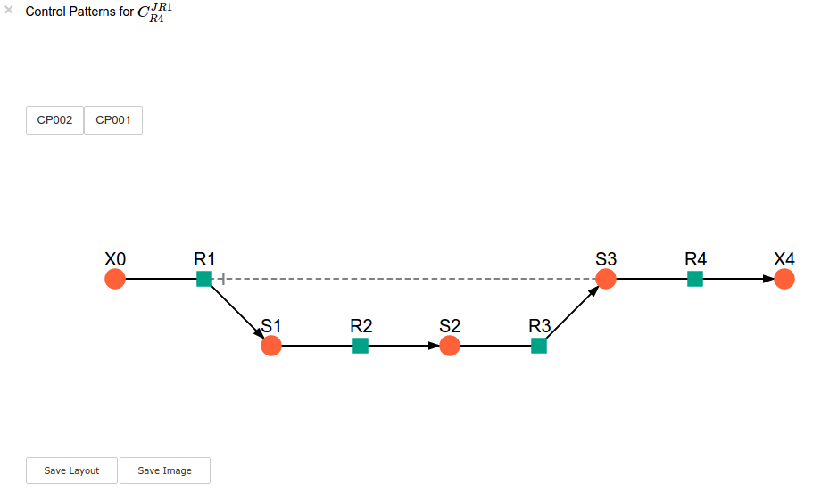
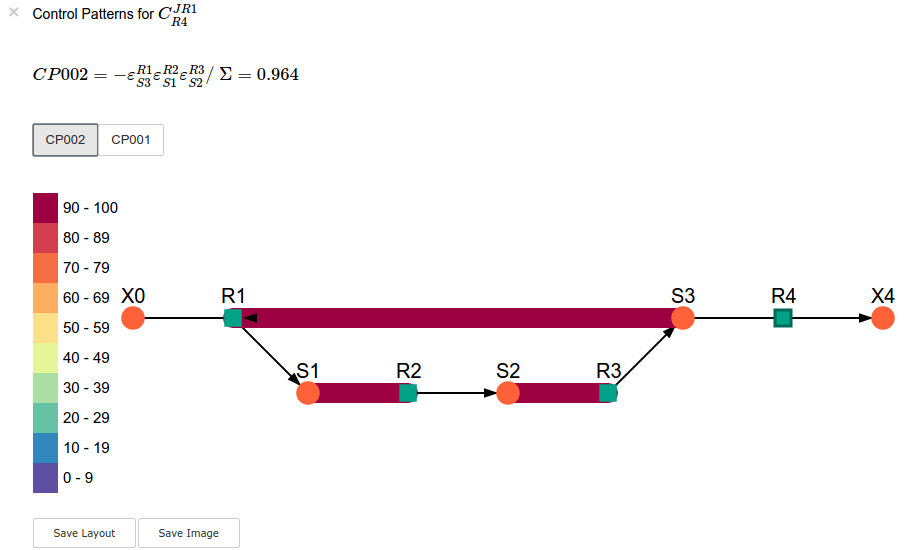
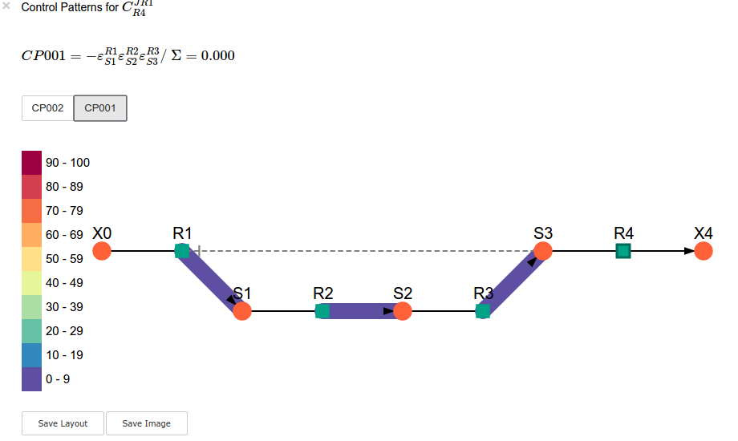
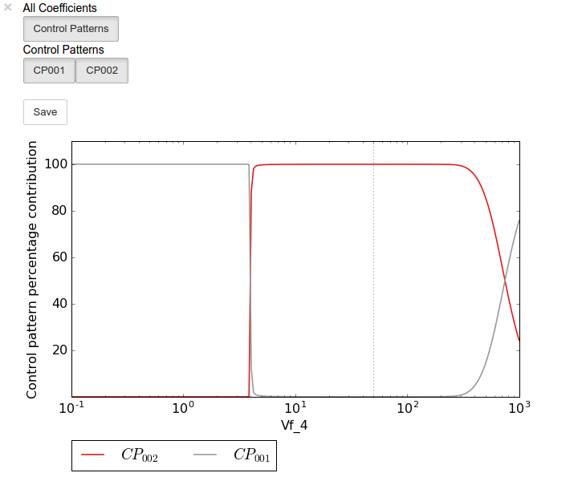
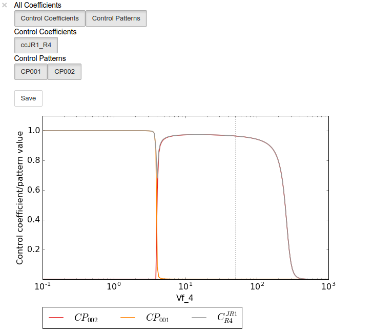

Symca
=====

Symca is used to perform symbolic metabolic control analysis
`[3,4] <references.html>`__ on metabolic pathway models in order to
dissect the control properties of these pathways in terms of the
different chains of local effects (or control patterns) that make up the
total control coefficient values. Symbolic/algebraic expressions are
generated for each control coefficient in a pathway which can be
subjected to further analysis.

Features
--------

-  Generates symbolic expressions for each control coefficient of a
   metabolic pathway model.
-  Splits control coefficients into control patterns that indicate the
   contribution of different chains of local effects.
-  Control coefficient and control pattern expressions can be
   manipulated using standard ``SymPy`` functionality.
-  Values of control coefficient and control pattern values are
   determined automatically and updated automatically following the
   calculation of standard (non-symbolic) control coefficient values
   subsequent to a parameter alteration.
-  Analysis sessions (raw expression data) can be saved to disk for
   later use.
-  The effect of parameter scans on control coefficient and control
   patters can be generated and displayed using ``ScanFig``.
-  Visualisation of control patterns by using ``ModelGraph``
   functionality.
-  Saving/loading of ``Symca`` sessions.
-  Saving of control pattern results.

Usage and feature walkthrough
-----------------------------

Workflow
~~~~~~~~

Performing symbolic control analysis with ``Symca`` usually requires the
following steps:

1. Instantiation of a ``Symca`` object using a ``PySCeS`` model object.
2. Generation of symbolic control coefficient expressions.
3. Access generated control coefficient expression results via
   ``cc_results`` and the corresponding control coefficient name (see
   `Basic Usage <basic_usage.html#syntax>`__)
4. Inspection of control coefficient values.
5. Inspection of control pattern values and their contributions towards
   the total control coefficient values.
6. Inspection of the effect of parameter changes (parameter scans) on
   the values of control coefficients and control patterns and the
   contribution of control patterns towards control coefficients.
7. Session/result saving if required
8. Further analysis.

Object instantiation
~~~~~~~~~~~~~~~~~~~~

Instantiation of a ``Symca`` analysis object requires ``PySCeS`` model
object (``PysMod``) as an argument. Using the included
`lin4\_fb.psc <included_files.html#lin4-fb-psc>`__ model a ``Symca``
session is instantiated as follows:

``In [1]:``

.. code:: python

    mod = pysces.model('lin4_fb')
    sc = psctb.Symca(mod)

``Out[1]:``

.. parsed-literal::

    Assuming extension is .psc
    Using model directory: /home/jr/Pysces/psc
    /home/jr/Pysces/psc/lin4_fb.psc loading ..... 
    Parsing file: /home/jr/Pysces/psc/lin4_fb.psc
    Info: "X4" has been initialised but does not occur in a rate equation
     
    Calculating L matrix . . . . . . .  done.
    Calculating K matrix . . . . . . .  done.
     
    (hybrd) The solution converged.

Additionally ``Symca`` has the following arguments:

-  ``internal_fixed``: This must be set to ``True`` in the case where an
   internal metabolite has a fixed concentration *(default: ``False``)*
-  ``auto_load``: If ``True`` ``Symca`` will try to load a previously
   saved session. Saved data is unaffected by the ``internal_fixed``
   argument above *(default: ``False``)*.

.. note:: For the case where an internal metabolite is fixed see `Fixed
          internal metabolites <Symca.html#fixed-internal-metabolites>`__ below.

Generating symbolic control coefficient expressions
~~~~~~~~~~~~~~~~~~~~~~~~~~~~~~~~~~~~~~~~~~~~~~~~~~~

Control coefficient expressions can be generated as soon as a ``Symca``
object has been instantiated using the ``do_symca`` method. This process
can potentially take quite some time to complete, therefore we recommend
saving the generated expressions for later loading (see `Saving/Loading
Sessions <Symca.html#saving-loading-sessions>`__ below). In the case of
``lin4_fb.psc`` expressions should be generated within a few seconds.

``In [2]:``

.. code:: python

    sc.do_symca()

``Out[2]:``

.. parsed-literal::

    Simplifying matrix with 28 elements
    ****************************

``do_symca`` has the following arguments:

-  ``internal_fixed``: This must be set to ``True`` in the case where an
   internal metabolite has a fixed concentration *(default: ``False``)*
-  ``auto_save_load``: If set to ``True`` ``Symca`` will attempt to load
   a previously saved session and only generate new expressions in case
   of a failure. After generation of new results, these results will be
   saved instead. Setting ``internal_fixed`` to ``True`` does not affect
   previously saved results that were generated with this argument set
   to ``False`` *(default: ``False``)*.

Accessing control coefficient expressions
~~~~~~~~~~~~~~~~~~~~~~~~~~~~~~~~~~~~~~~~~

Generated results may be accessed via a dictionary-like ``cc_results``
object (see `Basic Usage - Tables <basic_usage.html#tables>`__).
Inspecting this ``cc_results`` object in a IPython/Jupyter notebook
yields a table of control coefficient values:

``In [3]:``

.. code:: python

    sc.cc_results

.. raw:: html

   

+---------------------------+-------------+
| :math:`C^{JR1}_{R1}`      | 0.036       |
+---------------------------+-------------+
| :math:`C^{JR1}_{R2}`      | 3.090e-06   |
+---------------------------+-------------+
| :math:`C^{JR1}_{R3}`      | 1.657e-06   |
+---------------------------+-------------+
| :math:`C^{JR1}_{R4}`      | 0.964       |
+---------------------------+-------------+
| :math:`C^{JR2}_{R1}`      | 0.036       |
+---------------------------+-------------+
| :math:`C^{JR2}_{R2}`      | 3.090e-06   |
+---------------------------+-------------+
| :math:`C^{JR2}_{R3}`      | 1.657e-06   |
+---------------------------+-------------+
| :math:`C^{JR2}_{R4}`      | 0.964       |
+---------------------------+-------------+
| :math:`C^{JR3}_{R1}`      | 0.036       |
+---------------------------+-------------+
| :math:`C^{JR3}_{R2}`      | 3.090e-06   |
+---------------------------+-------------+

+---------------------------+-------------+
| :math:`C^{JR3}_{R3}`      | 1.657e-06   |
+---------------------------+-------------+
| :math:`C^{JR3}_{R4}`      | 0.964       |
+---------------------------+-------------+
| :math:`C^{JR4}_{R1}`      | 0.036       |
+---------------------------+-------------+
| :math:`C^{JR4}_{R2}`      | 3.090e-06   |
+---------------------------+-------------+
| :math:`C^{JR4}_{R3}`      | 1.657e-06   |
+---------------------------+-------------+
| :math:`C^{JR4}_{R4}`      | 0.964       |
+---------------------------+-------------+
| :math:`C^{S1}_{R1}`       | 0.323       |
+---------------------------+-------------+
| :math:`C^{S1}_{R2}`       | -0.092      |
+---------------------------+-------------+
| :math:`C^{S1}_{R3}`       | -0.049      |
+---------------------------+-------------+
| :math:`C^{S1}_{R4}`       | -0.182      |
+---------------------------+-------------+

+--------------------------+-------------+
| :math:`C^{S2}_{R1}`      | 0.335       |
+--------------------------+-------------+
| :math:`C^{S2}_{R2}`      | 2.885e-05   |
+--------------------------+-------------+
| :math:`C^{S2}_{R3}`      | -0.052      |
+--------------------------+-------------+
| :math:`C^{S2}_{R4}`      | -0.284      |
+--------------------------+-------------+
| :math:`C^{S3}_{R1}`      | 0.334       |
+--------------------------+-------------+
| :math:`C^{S3}_{R2}`      | 2.871e-05   |
+--------------------------+-------------+
| :math:`C^{S3}_{R3}`      | 1.539e-05   |
+--------------------------+-------------+
| :math:`C^{S3}_{R4}`      | -0.334      |
+--------------------------+-------------+
| :math:`\Sigma`           | 631.138     |
+--------------------------+-------------+

.. raw:: html

   

Inspecting an individual control coefficient yields a symbolic
expression together with a value:

``In [4]:``

.. code:: python

    sc.cc_results.ccJR1_R4

.. math::

    C^{JR1}_{R4} = (- \varepsilon^{R1}_{S1} \varepsilon^{R2}_{S2} \varepsilon^{R3}_{S3} - \varepsilon^{R1}_{S3} \varepsilon^{R2}_{S1} \varepsilon^{R3}_{S2})/~\Sigma = 0.964

In the above example, the expression of the control coefficient consists
of two numerator terms and a common denominator shared by all the
control coefficient expression signified by :math:`\Sigma`.

Various properties of this control coefficient can be accessed such as
the: \* Expression (as a ``SymPy`` expression)

``In [5]:``

.. code:: python

    sc.cc_results.ccJR1_R4.expression

.. math::

    \displaystyle \frac{- ecR_{1 S1} ecR_{2 S2} ecR_{3 S3} - ecR_{1 S3} ecR_{2 S1} ecR_{3 S2}}{- ecR_{1 S1} ecR_{2 S2} ecR_{3 S3} + ecR_{1 S1} ecR_{2 S2} ecR_{4 S3} - ecR_{1 S1} ecR_{3 S2} ecR_{4 S3} - ecR_{1 S3} ecR_{2 S1} ecR_{3 S2} + ecR_{2 S1} ecR_{3 S2} ecR_{4 S3}}

-  Numerator expression (as a ``SymPy`` expression)

``In [6]:``

.. code:: python

    sc.cc_results.ccJR1_R4.numerator

.. math::

    \displaystyle - ecR_{1 S1} ecR_{2 S2} ecR_{3 S3} - ecR_{1 S3} ecR_{2 S1} ecR_{3 S2}

-  Denominator expression (as a ``SymPy`` expression)

``In [7]:``

.. code:: python

    sc.cc_results.ccJR1_R4.denominator

.. math::

    \displaystyle - ecR_{1 S1} ecR_{2 S2} ecR_{3 S3} + ecR_{1 S1} ecR_{2 S2} ecR_{4 S3} - ecR_{1 S1} ecR_{3 S2} ecR_{4 S3} - ecR_{1 S3} ecR_{2 S1} ecR_{3 S2} + ecR_{2 S1} ecR_{3 S2} ecR_{4 S3}

-  Value (as a ``float64``)

``In [8]:``

.. code:: python

    sc.cc_results.ccJR1_R4.value

``Out[8]:``

.. parsed-literal::

    0.9640799846074221

Additional, less pertinent, attributes are ``abs_value``,
``latex_expression``, ``latex_expression_full``, ``latex_numerator``,
``latex_name``, ``name`` and ``denominator_object``.

The individual control coefficient numerator terms, otherwise known as
control patterns, may also be accessed as follows:

``In [9]:``

.. code:: python

    sc.cc_results.ccJR1_R4.CP001

.. math::

    CP001 = - \varepsilon^{R1}_{S1} \varepsilon^{R2}_{S2} \varepsilon^{R3}_{S3}/~\Sigma = 0.000

``In [10]:``

.. code:: python

    sc.cc_results.ccJR1_R4.CP002

.. math::

    CP002 = - \varepsilon^{R1}_{S3} \varepsilon^{R2}_{S1} \varepsilon^{R3}_{S2}/~\Sigma = 0.964

Each control pattern is numbered arbitrarily starting from 001 and has
similar properties as the control coefficient object (i.e., their
expression, numerator, value etc. can also be accessed).

Control pattern percentage contribution
^^^^^^^^^^^^^^^^^^^^^^^^^^^^^^^^^^^^^^^

Additionally control patterns have a ``percentage`` field which
indicates the degree to which a particular control pattern contributes
towards the overall control coefficient value:

``In [11]:``

.. code:: python

    sc.cc_results.ccJR1_R4.CP001.percentage

``Out[11]:``

.. parsed-literal::

    0.03087580996475991

``In [12]:``

.. code:: python

    sc.cc_results.ccJR1_R4.CP002.percentage

``Out[12]:``

.. parsed-literal::

    99.96912419003525

Unlike conventional percentages, however, these values are calculated as
percentage contribution towards the sum of the absolute values of all
the control coefficients (rather than as the percentage of the total
control coefficient value). This is done to account for situations where
control pattern values have different signs.

A particularly problematic example of where the above method is
necessary, is a hypothetical control coefficient with a value of zero,
but with two control patterns with equal value but opposite signs. In
this case a conventional percentage calculation would lead to an
undefined (``nan``) result, whereas our methodology would indicate that
each control pattern is equally (:math:`50\%`) responsible for the
observed control coefficient value.

Dynamic value updating
~~~~~~~~~~~~~~~~~~~~~~

The values of the control coefficients and their control patterns are
automatically updated when new steady-state elasticity coefficients are
calculated for the model. Thus changing a parameter of ``lin4_hill``,
such as the :math:`V_{f}` value of reaction 4, will lead to new control
coefficient and control pattern values:

``In [13]:``

.. code:: python

    mod.reLoad()
    # mod.Vf_4 has a default value of 50
    mod.Vf_4 = 0.1
    # calculating new steady state
    mod.doMca()

``Out[13]:``

.. parsed-literal::

    
    Parsing file: /home/jr/Pysces/psc/lin4_fb.psc
    Info: "X4" has been initialised but does not occur in a rate equation
     
    Calculating L matrix . . . . . . .  done.
    Calculating K matrix . . . . . . .  done.
     
    (hybrd) The solution converged.

``In [14]:``

.. code:: python

    # now ccJR1_R4 and its two control patterns should have new values
    sc.cc_results.ccJR1_R4

.. math::

    C^{JR1}_{R4} = (- \varepsilon^{R1}_{S1} \varepsilon^{R2}_{S2} \varepsilon^{R3}_{S3} - \varepsilon^{R1}_{S3} \varepsilon^{R2}_{S1} \varepsilon^{R3}_{S2})/~\Sigma = 1.000

``In [15]:``

.. code:: python

    # original value was 0.000
    sc.cc_results.ccJR1_R4.CP001

.. math::

    CP001 = - \varepsilon^{R1}_{S1} \varepsilon^{R2}_{S2} \varepsilon^{R3}_{S3}/~\Sigma = 1.000

``In [16]:``

.. code:: python

    # original value was 0.964
    sc.cc_results.ccJR1_R4.CP002

.. math::

    CP002 = - \varepsilon^{R1}_{S3} \varepsilon^{R2}_{S1} \varepsilon^{R3}_{S2}/~\Sigma = 0.000

``In [17]:``

.. code:: python

    # resetting to default Vf_4 value and recalculating
    mod.reLoad()
    mod.doMca()

``Out[17]:``

.. parsed-literal::

    
    Parsing file: /home/jr/Pysces/psc/lin4_fb.psc
    Info: "X4" has been initialised but does not occur in a rate equation
     
    Calculating L matrix . . . . . . .  done.
    Calculating K matrix . . . . . . .  done.
     
    (hybrd) The solution converged.

Control pattern graphs
~~~~~~~~~~~~~~~~~~~~~~

As described under `Basic
Usage <basic_usage.html#graphic-representation-of-metabolic-networks>`__,
``Symca`` has the functionality to display the chains of local effects
represented by control patterns on a scheme of a metabolic model. This
functionality can be accessed via the ``highlight_patterns`` method:

``In [18]:``

.. code:: python

    # This path leads to the provided layout file 
    path_to_layout = '~/Pysces/psc/lin4_fb.dict'
    
    # Correct path depending on platform - necessary for platform independent scripts
    if platform == 'win32' and pysces.version.current_version_tuple() < (0,9,8):
        path_to_layout = psctb.utils.misc.unix_to_windows_path(path_to_layout)
    else:
        path_to_layout = path.expanduser(path_to_layout)

``In [19]:``

.. code:: python

    sc.cc_results.ccJR1_R4.highlight_patterns(height = 350, pos_dic=path_to_layout)

``highlight_patterns`` has the following optional arguments:

-  ``width``: Sets the width of the graph (*default*: 900).
-  ``height``:Sets the height of the graph (*default*: 500).
-  ``show_dummy_sinks``: If ``True`` reactants with the "dummy" or
   "sink" will not be displayed (*default*: ``False``).
-  ``show_external_modifier_links``: If ``True`` edges representing the
   interaction of external effectors with reactions will be shown
   (*default*: ``False``).

Clicking either of the two buttons representing the control patterns
highlights these patterns according according to their percentage
contribution (as discussed
`above <Symca.html#control-pattern-percentage-contribution>`__) towards
the total control coefficient.

``In [20]:``

.. code:: python

    # clicking on CP002 shows that this control pattern representing 
    # the chain of effects passing through the feedback loop
    # is totally responsible for the observed control coefficient value.
    sc.cc_results.ccJR1_R4.highlight_patterns(height = 350, pos_dic=path_to_layout)

``In [21]:``

.. code:: python

    # clicking on CP001 shows that this control pattern representing 
    # the chain of effects of the main pathway does not contribute
    # at all to the control coefficient value.
    sc.cc_results.ccJR1_R4.highlight_patterns(height = 350, pos_dic=path_to_layout)

Parameter scans
~~~~~~~~~~~~~~~

Parameter scans can be performed in order to determine the effect of a
parameter change on either the control coefficient and control pattern
values or of the effect of a parameter change on the contribution of the
control patterns towards the control coefficient (as discussed
`above <Symca.html#control-pattern-percentage-contribution>`__). The
procedures for both the "value" and "percentage" scans are very much the
same and rely on the same principles as described in the `Basic
Usage <basic_usage.html#plotting-and-displaying-results>`__ and
`RateChar <RateChar.html#plotting-results>`__ sections.

To perform a parameter scan the ``do_par_scan`` method is called. This
method has the following arguments:

-  ``parameter``: A String representing the parameter which should be
   varied.
-  ``scan_range``: Any iterable representing the range of values over
   which to vary the parameter (typically a NumPy ``ndarray`` generated
   by ``numpy.linspace`` or ``numpy.logspace``).
-  ``scan_type``: Either ``"percentage"`` or ``"value"`` as described
   above (*default*: ``"percentage"``).
-  ``init_return``: If ``True`` the parameter value will be reset to its
   initial value after performing the parameter scan (*default*:
   ``True``).
-  ``par_scan``: If ``True``, the parameter scan will be performed by
   multiple parallel processes rather than a single process, thus
   speeding performance (*default*: ``False``).
-  ``par_engine``: Specifies the engine to be used for the parallel
   scanning processes. Can either be ``"multiproc"`` or ``"ipcluster"``.
   A discussion of the differences between these methods are beyond the
   scope of this document, see
   `here <http://www.davekuhlman.org/python_multiprocessing_01.html>`__
   for a brief overview of Multiprocessing in Python. (*default*:
   ``"multiproc"``).
-  ``force_legacy``: If ``True`` ``do_par_scan`` will use a older and
   slower algorithm for performing the parameter scan. This is mostly
   used for debugging purposes. (*default*: ``False``)

Below we will perform a percentage scan of :math:`V_{f4}` for 200 points
between 0.01 and 1000 in log space:

``In [22]:``

.. code:: python

    percentage_scan_data = sc.cc_results.ccJR1_R4.do_par_scan(parameter='Vf_4',
                                                              scan_range=numpy.logspace(-1,3,200),
                                                              scan_type='percentage')

``Out[22]:``

.. parsed-literal::

    MaxMode 1
    0 min 0 sec
    SCANNER: Tsteps 200
    
    SCANNER: 200 states analysed
    
    (hybrd) The solution converged.

As previously described, these data can be displayed using ``ScanFig``
by calling the ``plot`` method of ``percentage_scan_data``. Furthermore,
lines can be enabled/disabled using the ``toggle_category`` method of
``ScanFig`` or by clicking on the appropriate buttons:

``In [23]:``

.. code:: python

    percentage_scan_plot = percentage_scan_data.plot()
    
    # set the x-axis to a log scale
    percentage_scan_plot.ax.semilogx()
    
    # enable all the lines
    percentage_scan_plot.toggle_category('Control Patterns', True)
    percentage_scan_plot.toggle_category('CP001', True)
    percentage_scan_plot.toggle_category('CP002', True)
    
    # display the plot
    percentage_scan_plot.interact()

A ``value`` plot can similarly be generated and displayed. In this case,
however, an additional line indicating :math:`C^{J}_{4}` will also be
present:

``In [24]:``

.. code:: python

    value_scan_data = sc.cc_results.ccJR1_R4.do_par_scan(parameter='Vf_4',
                                                         scan_range=numpy.logspace(-1,3,200),
                                                         scan_type='value')
    
    value_scan_plot = value_scan_data.plot()
    
    # set the x-axis to a log scale
    value_scan_plot.ax.semilogx()
    
    # enable all the lines
    value_scan_plot.toggle_category('Control Coefficients', True)
    value_scan_plot.toggle_category('ccJR1_R4', True)
    
    value_scan_plot.toggle_category('Control Patterns', True)
    value_scan_plot.toggle_category('CP001', True)
    value_scan_plot.toggle_category('CP002', True)
    
    # display the plot
    value_scan_plot.interact()

Fixed internal metabolites
~~~~~~~~~~~~~~~~~~~~~~~~~~

In the case where the concentration of an internal intermediate is fixed
(such as in the case of a GSDA) the ``internal_fixed`` argument must be
set to ``True`` in either the ``do_symca`` method, or when instantiating
the ``Symca`` object. This will typically result in the creation of a
``cc_results_N`` object for each separate reaction block, where ``N`` is
a number starting at 0. Results can then be accessed via these objects
as with normal free internal intermediate models.

Thus for a variant of the ``lin4_fb`` model where the
intermediate\ ``S3`` is fixed at its steady-state value the procedure is
as follows:

``In [25]:``

.. code:: python

    # Create a variant of mod with 'C' fixed at its steady-state value
    mod_fixed_S3 = psctb.modeltools.fix_metabolite_ss(mod, 'S3')
    
    # Instantiate Symca object the 'internal_fixed' argument set to 'True'
    sc_fixed_S3 = psctb.Symca(mod_fixed_S3,internal_fixed=True)
    
    # Run the 'do_symca' method (internal_fixed can also be set to 'True' here)
    sc_fixed_S3.do_symca() 

``Out[25]:``

.. parsed-literal::

    (hybrd) The solution converged.
    
    I hope we have a filebuffer
    Seems like it
    
    Reaction stoichiometry and rate equations
    
    Species initial values
    
    Parameters
    Assuming extension is .psc
    Using model directory: /home/jr/Pysces/psc
    Using file: lin4_fb_S3.psc
    /home/jr/Pysces/psc/orca/lin4_fb_S3.psc loading ..... 
    Parsing file: /home/jr/Pysces/psc/orca/lin4_fb_S3.psc
    Info: "X4" has been initialised but does not occur in a rate equation
     
    Calculating L matrix . . . . . . .  done.
    Calculating K matrix . . . . . . .  done.
     
    (hybrd) The solution converged.
    Simplifying matrix with 24 elements
    ************************

The normal ``sc_fixed_S3.cc_results`` object is still generated, but
will be invalid for the fixed model. Each additional ``cc_results_N``
contains control coefficient expressions that have the same common
denominator and corresponds to a specific reaction block. These
``cc_results_N`` objects are numbered arbitrarily, but consistantly
accross different sessions. Each results object accessed and utilised in
the same way as the normal ``cc_results`` object.

For the ``mod_fixed_c`` model two additional results objects
(``cc_results_0`` and ``cc_results_1``) are generated:

-  ``cc_results_1`` contains the control coefficients describing the
   sensitivity of flux and concentrations within the supply block of
   ``S3`` towards reactions within the supply block.

``In [26]:``

.. code:: python

    sc_fixed_S3.cc_results_1

.. raw:: html

   

+---------------------------+-------------+
| :math:`C^{JR1}_{R1}`      | 1.000       |
+---------------------------+-------------+
| :math:`C^{JR1}_{R2}`      | 8.603e-05   |
+---------------------------+-------------+
| :math:`C^{JR1}_{R3}`      | 4.612e-05   |
+---------------------------+-------------+
| :math:`C^{JR2}_{R1}`      | 1.000       |
+---------------------------+-------------+
| :math:`C^{JR2}_{R2}`      | 8.603e-05   |
+---------------------------+-------------+
| :math:`C^{JR2}_{R3}`      | 4.612e-05   |
+---------------------------+-------------+
| :math:`C^{JR3}_{R1}`      | 1.000       |
+---------------------------+-------------+
| :math:`C^{JR3}_{R2}`      | 8.603e-05   |
+---------------------------+-------------+
| :math:`C^{JR3}_{R3}`      | 4.612e-05   |
+---------------------------+-------------+
| :math:`C^{S1}_{R1}`       | 0.141       |
+---------------------------+-------------+

+--------------------------+-------------+
| :math:`C^{S1}_{R2}`      | -0.092      |
+--------------------------+-------------+
| :math:`C^{S1}_{R3}`      | -0.049      |
+--------------------------+-------------+
| :math:`C^{S2}_{R1}`      | 0.052       |
+--------------------------+-------------+
| :math:`C^{S2}_{R2}`      | 4.446e-06   |
+--------------------------+-------------+
| :math:`C^{S2}_{R3}`      | -0.052      |
+--------------------------+-------------+
| :math:`\Sigma`           | 210.616     |
+--------------------------+-------------+

.. raw:: html

   

-  ``cc_results_0`` contains the control coefficients describing the
   sensitivity of flux and concentrations of either reaction block
   towards reactions in the other reaction block (i.e., all control
   coefficients here should be zero). Due to the fact that the ``S3``
   demand block consists of a single reaction, this object also contains
   the control coefficient of ``R4`` on ``J_R4``, which is equal to one.
   This results object is useful confirming that the results were
   generated as expected.

``In [27]:``

.. code:: python

    sc_fixed_S3.cc_results_0

.. raw:: html

   

+---------------------------+---------+
| :math:`C^{JR1}_{R4}`      | 0.000   |
+---------------------------+---------+
| :math:`C^{JR2}_{R4}`      | 0.000   |
+---------------------------+---------+
| :math:`C^{JR3}_{R4}`      | 0.000   |
+---------------------------+---------+
| :math:`C^{JR4}_{R1}`      | 0.000   |
+---------------------------+---------+
| :math:`C^{JR4}_{R2}`      | 0.000   |
+---------------------------+---------+
| :math:`C^{JR4}_{R3}`      | 0.000   |
+---------------------------+---------+
| :math:`C^{JR4}_{R4}`      | 1.000   |
+---------------------------+---------+
| :math:`C^{S1}_{R4}`       | 0.000   |
+---------------------------+---------+
| :math:`C^{S2}_{R4}`       | 0.000   |
+---------------------------+---------+
| :math:`\Sigma`            | 1.000   |
+---------------------------+---------+

.. raw:: html

   

If the demand block of ``S3`` in this pathway consisted of multiple
reactions, rather than a single reaction, there would have been an
additional ``cc_results_N`` object containing the control coefficients
of that reaction block.

Saving results
~~~~~~~~~~~~~~

In addition to being able to save parameter scan results (as previously
described), a summary of the control coefficient and control pattern
results can be saved using the ``save_results`` method. This saves a
``csv`` file (by default) to disk to any specified location. If no
location is specified, a file named ``cc_summary_N`` is saved to the
``~/Pysces/$modelname/symca/`` directory, where ``N`` is a number
starting at 0:

``In [28]:``

.. code:: python

    sc.save_results()

``save_results`` has the following optional arguments:

-  ``file_name``: Specifies a path to save the results to. If ``None``,
   the path defaults as described above.
-  ``separator``: The separator between fields (*default*: ``","``)

The contents of the saved data file is as follows:

``In [29]:``

.. code:: python

    # the following code requires `pandas` to run
    import pandas as pd
    # load csv file at default path
    results_path = '~/Pysces/lin4_fb/symca/cc_summary_0.csv'
    
    # Correct path depending on platform - necessary for platform independent scripts
    if platform == 'win32' and pysces.version.current_version_tuple() < (0,9,8):
        results_path = psctb.utils.misc.unix_to_windows_path(results_path)
    else:
        results_path = path.expanduser(results_path)
    
    saved_results = pd.read_csv(results_path)
    # show first 20 lines
    saved_results.head(n=20) 

.. raw:: html

   

.. raw:: html

   

    
    <table border="1" class="dataframe">
      <thead>
        <tr style="text-align: right;">
          <th></th>
          <th># name</th>
          <th>value</th>
          <th>latex_name</th>
          <th>latex_expression</th>
        </tr>
      </thead>
      <tbody>
        <tr>
          <th>0</th>
          <td># results from cc_results</td>
          <td>0.000000</td>
          <td>nan</td>
          <td>nan</td>
        </tr>
        <tr>
          <th>1</th>
          <td>ccJR1_R1</td>
          <td>0.035915</td>
          <td>C^{JR1}_{R1}</td>
          <td>(\varepsilon^{R2}_{S1} \varepsilon^{R3}_{S2} \...</td>
        </tr>
        <tr>
          <th>2</th>
          <td>CP001</td>
          <td>0.035915</td>
          <td>CP001</td>
          <td>\varepsilon^{R2}_{S1} \varepsilon^{R3}_{S2} \v...</td>
        </tr>
        <tr>
          <th>3</th>
          <td>ccJR1_R2</td>
          <td>0.000003</td>
          <td>C^{JR1}_{R2}</td>
          <td>(- \varepsilon^{R1}_{S1} \varepsilon^{R3}_{S2}...</td>
        </tr>
        <tr>
          <th>4</th>
          <td>CP001</td>
          <td>0.000003</td>
          <td>CP001</td>
          <td>- \varepsilon^{R1}_{S1} \varepsilon^{R3}_{S2} ...</td>
        </tr>
        <tr>
          <th>5</th>
          <td>ccJR1_R3</td>
          <td>0.000002</td>
          <td>C^{JR1}_{R3}</td>
          <td>(\varepsilon^{R1}_{S1} \varepsilon^{R2}_{S2} \...</td>
        </tr>
        <tr>
          <th>6</th>
          <td>CP001</td>
          <td>0.000002</td>
          <td>CP001</td>
          <td>\varepsilon^{R1}_{S1} \varepsilon^{R2}_{S2} \v...</td>
        </tr>
        <tr>
          <th>7</th>
          <td>ccJR1_R4</td>
          <td>0.964080</td>
          <td>C^{JR1}_{R4}</td>
          <td>(- \varepsilon^{R1}_{S1} \varepsilon^{R2}_{S2}...</td>
        </tr>
        <tr>
          <th>8</th>
          <td>CP001</td>
          <td>0.000298</td>
          <td>CP001</td>
          <td>- \varepsilon^{R1}_{S1} \varepsilon^{R2}_{S2} ...</td>
        </tr>
        <tr>
          <th>9</th>
          <td>CP002</td>
          <td>0.963782</td>
          <td>CP002</td>
          <td>- \varepsilon^{R1}_{S3} \varepsilon^{R2}_{S1} ...</td>
        </tr>
        <tr>
          <th>10</th>
          <td>ccJR2_R1</td>
          <td>0.035915</td>
          <td>C^{JR2}_{R1}</td>
          <td>(\varepsilon^{R2}_{S1} \varepsilon^{R3}_{S2} \...</td>
        </tr>
        <tr>
          <th>11</th>
          <td>CP001</td>
          <td>0.035915</td>
          <td>CP001</td>
          <td>\varepsilon^{R2}_{S1} \varepsilon^{R3}_{S2} \v...</td>
        </tr>
        <tr>
          <th>12</th>
          <td>ccJR2_R2</td>
          <td>0.000003</td>
          <td>C^{JR2}_{R2}</td>
          <td>(- \varepsilon^{R1}_{S1} \varepsilon^{R3}_{S2}...</td>
        </tr>
        <tr>
          <th>13</th>
          <td>CP001</td>
          <td>0.000003</td>
          <td>CP001</td>
          <td>- \varepsilon^{R1}_{S1} \varepsilon^{R3}_{S2} ...</td>
        </tr>
        <tr>
          <th>14</th>
          <td>ccJR2_R3</td>
          <td>0.000002</td>
          <td>C^{JR2}_{R3}</td>
          <td>(\varepsilon^{R1}_{S1} \varepsilon^{R2}_{S2} \...</td>
        </tr>
        <tr>
          <th>15</th>
          <td>CP001</td>
          <td>0.000002</td>
          <td>CP001</td>
          <td>\varepsilon^{R1}_{S1} \varepsilon^{R2}_{S2} \v...</td>
        </tr>
        <tr>
          <th>16</th>
          <td>ccJR2_R4</td>
          <td>0.964080</td>
          <td>C^{JR2}_{R4}</td>
          <td>(- \varepsilon^{R1}_{S1} \varepsilon^{R2}_{S2}...</td>
        </tr>
        <tr>
          <th>17</th>
          <td>CP001</td>
          <td>0.000298</td>
          <td>CP001</td>
          <td>- \varepsilon^{R1}_{S1} \varepsilon^{R2}_{S2} ...</td>
        </tr>
        <tr>
          <th>18</th>
          <td>CP002</td>
          <td>0.963782</td>
          <td>CP002</td>
          <td>- \varepsilon^{R1}_{S3} \varepsilon^{R2}_{S1} ...</td>
        </tr>
        <tr>
          <th>19</th>
          <td>ccJR3_R1</td>
          <td>0.035915</td>
          <td>C^{JR3}_{R1}</td>
          <td>(\varepsilon^{R2}_{S1} \varepsilon^{R3}_{S2} \...</td>
        </tr>
      </tbody>
    </table>
    

Saving/loading sessions
~~~~~~~~~~~~~~~~~~~~~~~

Saving and loading ``Symca`` sessions is very simple and works similar
to ``RateChar``. Saving a session takes place with the ``save_session``
method, whereas the ``load_session`` method loads the saved expressions.
As with the ``save_results`` method and most other saving and loading
functionality, if no ``file_name`` argument is provided, files will be
saved to the default directory (see also `Basic
Usage <basic_usage.html#saving-and-default-directories>`__). As
previously described, expressions can also automatically be loaded/saved
by ``do_symca`` by using the ``auto_save_load`` argument which saves and
loads using the default path. Models with internal fixed metabolites are
handled automatically.

``In [30]:``

.. code:: python

    # saving session
    sc.save_session()
    
    # create new Symca object and load saved results
    new_sc = psctb.Symca(mod)
    new_sc.load_session()
    
    # display saved results
    new_sc.cc_results

``Out[30]:``

.. parsed-literal::

    (hybrd) The solution converged.

.. raw:: html

   

+---------------------------+-------------+
| :math:`C^{JR1}_{R1}`      | 0.036       |
+---------------------------+-------------+
| :math:`C^{JR1}_{R2}`      | 3.090e-06   |
+---------------------------+-------------+
| :math:`C^{JR1}_{R3}`      | 1.657e-06   |
+---------------------------+-------------+
| :math:`C^{JR1}_{R4}`      | 0.964       |
+---------------------------+-------------+
| :math:`C^{JR2}_{R1}`      | 0.036       |
+---------------------------+-------------+
| :math:`C^{JR2}_{R2}`      | 3.090e-06   |
+---------------------------+-------------+
| :math:`C^{JR2}_{R3}`      | 1.657e-06   |
+---------------------------+-------------+
| :math:`C^{JR2}_{R4}`      | 0.964       |
+---------------------------+-------------+
| :math:`C^{JR3}_{R1}`      | 0.036       |
+---------------------------+-------------+
| :math:`C^{JR3}_{R2}`      | 3.090e-06   |
+---------------------------+-------------+

+---------------------------+-------------+
| :math:`C^{JR3}_{R3}`      | 1.657e-06   |
+---------------------------+-------------+
| :math:`C^{JR3}_{R4}`      | 0.964       |
+---------------------------+-------------+
| :math:`C^{JR4}_{R1}`      | 0.036       |
+---------------------------+-------------+
| :math:`C^{JR4}_{R2}`      | 3.090e-06   |
+---------------------------+-------------+
| :math:`C^{JR4}_{R3}`      | 1.657e-06   |
+---------------------------+-------------+
| :math:`C^{JR4}_{R4}`      | 0.964       |
+---------------------------+-------------+
| :math:`C^{S1}_{R1}`       | 0.323       |
+---------------------------+-------------+
| :math:`C^{S1}_{R2}`       | -0.092      |
+---------------------------+-------------+
| :math:`C^{S1}_{R3}`       | -0.049      |
+---------------------------+-------------+
| :math:`C^{S1}_{R4}`       | -0.182      |
+---------------------------+-------------+

+--------------------------+-------------+
| :math:`C^{S2}_{R1}`      | 0.335       |
+--------------------------+-------------+
| :math:`C^{S2}_{R2}`      | 2.885e-05   |
+--------------------------+-------------+
| :math:`C^{S2}_{R3}`      | -0.052      |
+--------------------------+-------------+
| :math:`C^{S2}_{R4}`      | -0.284      |
+--------------------------+-------------+
| :math:`C^{S3}_{R1}`      | 0.334       |
+--------------------------+-------------+
| :math:`C^{S3}_{R2}`      | 2.871e-05   |
+--------------------------+-------------+
| :math:`C^{S3}_{R3}`      | 1.539e-05   |
+--------------------------+-------------+
| :math:`C^{S3}_{R4}`      | -0.334      |
+--------------------------+-------------+
| :math:`\Sigma`           | 631.138     |
+--------------------------+-------------+

.. raw:: html

   

