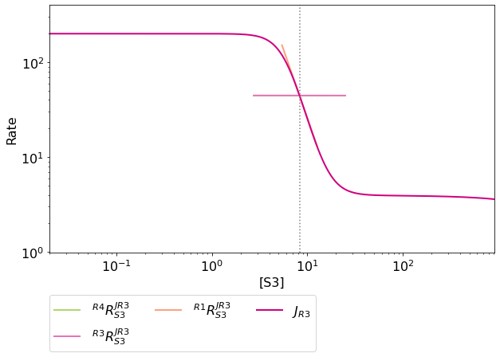
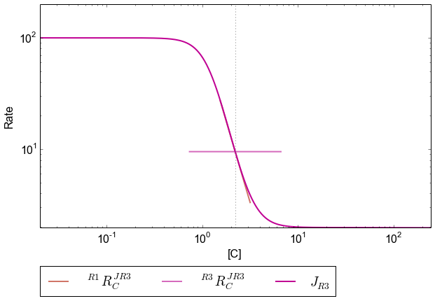

RateChar
========

RateChar is a tool for performing generalised supply-demand analysis
(GSDA) `[2,3] <references.html>`__. This entails the generation data
needed to draw rate characteristic plots for all the variable species of
metabolic model through parameter scans and the subsequent visualisation
of these data in the form of ``ScanFig`` objects.

Features
--------

-  Performs parameter scans for any variable species of a metabolic
   model
-  Stores results in a structure similar to ``Data2D``.
-  Saving of raw parameter scan data, together with metabolic control
   analysis results to disk.
-  Saving of ``RateChar`` sessions to disk for later use.
-  Generates rate characteristic plots from parameter scans (using
   ``ScanFig``).
-  Can perform parameter scans of any variable species with outputs for
   relevant response, partial response, elasticity and control
   coefficients (with data stores as ``Data2D`` objects).

Usage and Feature Walkthrough
-----------------------------

Workflow
~~~~~~~~

Performing GSDA with ``RateChar`` usually requires taking the following
steps:

1. Instantiation of ``RateChar`` object (optionally specifying default
   settings).
2. Performing a configurable parameter scan of any combination of
   variable species (or loading previously saved results).
3. Accessing scan results through ``RateCharData`` objects corresponding
   to the names of the scanned species that can be found as attributes
   of the instantiated ``RateChar`` object.
4. Plotting results of a particular species using the ``plot`` method of
   the ``RateCharData`` object corresponding to that species.
5. Further analysis using the ``do_mca_scan`` method.
6. Session/Result saving if required.
7. Further Analysis

.. note:: Parameter scans are performed for a range of concentrations
          values between two set values. By default the minimum and maximum scan
          range values are calculated relative to the steady state concentration
          the species for which a scan is performed respectively using a division
          and multiplication factor. Minimum and maximum values may also be
          explicitly specified. Furthermore the number of points for which a scan
          is performed may also be specified. Details of how to access these
          options will be discussed below.

1. Object Instantiation
~~~~~~~~~~~~~~~~~~~~~~~

Like most tools provided in PySCeSToolbox, instantiation of a
``RateChar`` object requires a pysces model object (``PysMod``) as an
argument. A ``RateChar`` session will typically be initiated as follows
(here we will use the included ``lin5_hill.psc`` model):

.. code:: python

    mod = pysces.model('lin5_hill')
    rc = psctb.RateChar(mod)

.. parsed-literal::

    Assuming extension is .psc
    Using model directory: /home/carl/Pysces/psc
    /home/carl/Pysces/psc/lin5_hill.psc loading ..... 
    Parsing file: /home/carl/Pysces/psc/lin5_hill.psc
    Info: "P" has been initialised but does not occur in a rate equation
     
    Calculating L matrix . . . . . . .  done.
    Calculating K matrix . . . . . . .  done.
     

Default parameter scan settings relating to a specific ``RateChar``
session can also be specified during instantiation:

.. code:: python

    rc = psctb.RateChar(mod,min_concrange_factor=100,max_concrange_factor=100,scan_points=255,auto_load=False)

-  ``min_concrange_factor`` : The steady state division factor for
   calculating scan range minimums *(default: 100)*.
-  ``max_concrange_factor`` : The steady state multiplication factor for
   calculating scan range maximums *(default: 100)*.
-  ``scan_points`` : The number of concentration sample points that will
   be taken during parameter scans *(default: 256)*.
-  ``auto_load`` : If ``True`` ``RateChar`` will try to load saved data
   from a previous session during instantiation. Saved data is
   unaffected by the above options and are only subject to the settings
   specified during the session where they were generated. *(default:*
   ``False``\ *)*.

The settings specified with these optional arguments take effect when
the corresponding arugments are not specified during a parameter scan.

2 Parameter Scan
~~~~~~~~~~~~~~~~

After object instantiation, parameter scans may be performed for any of
the variable species using the ``do_ratechar`` method. By default
``do_ratechar`` will perform parameter scans for all variable
metabolites using the settings specified during instantiation. For
saving/loading see `Saving/Loading
Sessions <RateChar.html#example-model>`__"Session Saving" below

.. code:: python

    rc.do_ratechar()

Various optional arguments, similar to those used during object
instantiation, can be used to override the default settings and
customise any parameter scan:

-  ``fixed`` : A string or list of strings specifying the species for
   which to perform a parameter scan. The string ``'all'`` specifies
   that all variable species should be scanned. *(default: ``all``)*
-  ``scan_min`` : The minimum value of the scan range, overrides
   ``min_concrange_factor`` *(default: None)*.
-  ``scan_max`` : The maximum value of the scan range, overrides
   ``max_concrange_factor`` *(default: None)*.
-  ``min_concrange_factor`` : The steady state division factor for
   calculating scan range minimums *(default: None)*
-  ``max_concrange_factor`` : The steady state multiplication factor for
   calculating scan range maximums *(default: None)*.
-  ``scan_points`` : The number of concentration sample points that will
   be taken during parameter scans *(default: None)*.
-  ``solver`` : An integer value that specifies which solver to use
   (0:Hybrd,1:NLEQ,2:FINTSLV). *(default: 0)*.

.. note:: For details on different solvers see the `PySCeS
          documentation <http://pysces.sourceforge.net/docs/userguide_doc.html#steady-state-analysis>`__):

For example in a scenario where we only wanted to perform parameter
scans of 200 points for the metabolites ``A`` and ``C`` starting at a
value of 0.02 and ending at a value 110 times their respective
steady-state values the method would be called as follows:

.. code:: python

    rc.do_ratechar(fixed=['A','C'], scan_min=0.02, max_concrange_factor=110, scan_points=200)

3. Accessing Results
~~~~~~~~~~~~~~~~~~~~

3.1 Parameter Scan Results
^^^^^^^^^^^^^^^^^^^^^^^^^^

Parameter scan results for any particular species are saved as an
attribute of the ``RateChar`` object under the name of that species.
These ``RateCharData`` objects are similar to ``Data2D`` objects with
parameter scan results being accessible through a ``scan_results``
DotDict:

.. code:: python

    # Each key represents a field through which results can be accessed
    sorted(rc.C.scan_results.keys())

.. parsed-literal::

    ['J_R3',
     'J_R4',
     'ecR3_C',
     'ecR4_C',
     'ec_data',
     'ec_names',
     'fixed',
     'fixed_ss',
     'flux_data',
     'flux_max',
     'flux_min',
     'flux_names',
     'prcJR3_C_R1',
     'prcJR3_C_R3',
     'prcJR3_C_R4',
     'prcJR4_C_R1',
     'prcJR4_C_R3',
     'prcJR4_C_R4',
     'prc_data',
     'prc_names',
     'rcJR3_C',
     'rcJR4_C',
     'rc_data',
     'rc_names',
     'scan_max',
     'scan_min',
     'scan_points',
     'scan_range',
     'total_demand',
     'total_supply']

.. note:: The ``DotDict`` data structure is essentially a dictionary
          with additional functionality for displaying results in table form (when
          appropriate) and for accessing data using dot notation in addition the
          normal dictionary bracket notation).

In the above dictionary-like structure each field can represent
different types of data, the most simple of which is a single value,
e.g., ``scan_min`` and ``fixed``, or a 1-dimensional numpy ndarray which
represent input (``scan_range``) or output (``J_R3``, ``J_R4``,
``total_supply``):

.. code:: python

    # Single value results
    
    # scan_min value
    rc.C.scan_results.scan_min

.. parsed-literal::

    0.020000000000000004

.. code:: python

    # fixed metabolite name
    rc.C.scan_results.fixed

.. parsed-literal::

    'C'

.. code:: python

    # 1-dimensional ndarray results (only every 10th value of 200 value arrays)
    
    # scan_range values
    rc.C.scan_results.scan_range[::10]

.. parsed-literal::

    array([  2.00000000e-02,   3.20835464e-02,   5.14676974e-02,
             8.25633129e-02,   1.32446194e-01,   2.12467180e-01,
             3.40835032e-01,   5.46759828e-01,   8.77099715e-01,
             1.40702347e+00,   2.25711514e+00,   3.62081291e+00,
             5.80842595e+00,   9.31774518e+00,   1.49473155e+01,
             2.39781445e+01,   3.84651955e+01,   6.17049943e+01,
             9.89857523e+01,   1.58790699e+02])

.. code:: python

    # J_R3 values for scan_range
    rc.C.scan_results.J_R3[::10]

.. parsed-literal::

    array([ 99.99723929,  99.99715896,  99.99680667,  99.9947619 ,
            99.98168514,  99.89591472,  99.33285568,  95.76327602,
            77.44198127,  34.87971881,   8.92798864,   3.09635547,
             2.15014933,   2.00552661,   1.98342879,   1.9797328 ,
             1.9785994 ,   1.97750519,   1.97585888,   1.9732336 ])

.. code:: python

    # total_supply values for scan_range
    rc.C.scan_results.total_supply[::10]
    
    # Note that J_R3 and total_supply are equal in this case, because C 
    # only has a single supply reaction

.. parsed-literal::

    array([ 99.99723929,  99.99715896,  99.99680667,  99.9947619 ,
            99.98168514,  99.89591472,  99.33285568,  95.76327602,
            77.44198127,  34.87971881,   8.92798864,   3.09635547,
             2.15014933,   2.00552661,   1.98342879,   1.9797328 ,
             1.9785994 ,   1.97750519,   1.97585888,   1.9732336 ])

Finally data needed to draw lines relating to metabolic control analysis
coefficients are also included in ``scan_results``. Data is supplied in
3 different forms: Lists names of the coefficients (under ``ec_names``,
``prc_names``, etc.), 2-dimensional arrays with exactly 4 values
(representing 2 sets of x,y coordinates) that will be used to plot
coefficient lines, and 2-dimensional array that collects coefficient
line data for each coefficient type into single arrays (under
``ec_data``, ``prc_names``, etc.).

.. code:: python

    # Metabolic Control Analysis coefficient line data
    
    # Names of elasticity coefficients related to the 'C' parameter scan
    rc.C.scan_results.ec_names

.. parsed-literal::

    ['ecR4_C', 'ecR3_C']

.. code:: python

    # The x, y coordinates for two points that will be used to plot a 
    # visual representation of ecR3_C
    rc.C.scan_results.ecR3_C

.. parsed-literal::

    array([[  2.17310179,  28.94552932],
           [  2.24511684,   3.12298399]])

.. code:: python

    # The x,y coordinates for two points that will be used to plot a 
    # visual representation of ecR4_C
    rc.C.scan_results.ecR4_C

.. parsed-literal::

    array([[  0.73730798,   8.98706435],
           [  6.6171364 ,  10.0585042 ]])

.. code:: python

    # The ecR3_C and ecR4_C data collected into a single array 
    # (horizontally stacked).
    rc.C.scan_results.ec_data

.. parsed-literal::

    array([[  0.73730798,   8.98706435,   2.17310179,  28.94552932],
           [  6.6171364 ,  10.0585042 ,   2.24511684,   3.12298399]])

3.2 Metabolic Control Analysis Results
^^^^^^^^^^^^^^^^^^^^^^^^^^^^^^^^^^^^^^

The in addition to being able to access the data that will be used to
draw rate characteristic plots, the user also has access to the values
of the metabolic control analysis coefficient values at the steady state
of any particular species via the ``mca_results`` field. This field
represents a ``DotDict`` dictionary-like object (like ``scan_results``),
however as each key maps to exactly one result, the data can be
displayed as a table (see `Basic Usage <basic_usage.html#tables>`__):

.. code:: python

    # Metabolic control analysis coefficient results 
    rc.C.mca_results

+------------------------------------+-------------+
| :math:`C^{JR3}_{R1}`               | 1.000       |
+------------------------------------+-------------+
| :math:`C^{JR3}_{R3}`               | 7.326e-07   |
+------------------------------------+-------------+
| :math:`C^{JR3}_{R4}`               | 0.000       |
+------------------------------------+-------------+
| :math:`C^{JR4}_{R1}`               | 0.000       |
+------------------------------------+-------------+
| :math:`C^{JR4}_{R3}`               | 0.000       |
+------------------------------------+-------------+
| :math:`C^{JR4}_{R4}`               | 0.918       |
+------------------------------------+-------------+
| :math:`\varepsilon^{R1}_{C}`       | -2.922      |
+------------------------------------+-------------+
| :math:`\varepsilon^{R3}_{C}`       | -68.297     |
+------------------------------------+-------------+
| :math:`\varepsilon^{R4}_{C}`       | 0.051       |
+------------------------------------+-------------+
| :math:`\,^{R1}R^{JR3}_{C}`         | -2.922      |
+------------------------------------+-------------+

+----------------------------------+--------------+
| :math:`\,^{R3}R^{JR3}_{C}`       | -5.004e-05   |
+----------------------------------+--------------+
| :math:`\,^{R4}R^{JR3}_{C}`       | 0.000        |
+----------------------------------+--------------+
| :math:`\,^{R1}R^{JR4}_{C}`       | -0.000       |
+----------------------------------+--------------+
| :math:`\,^{R3}R^{JR4}_{C}`       | -0.000       |
+----------------------------------+--------------+
| :math:`\,^{R4}R^{JR4}_{C}`       | 0.047        |
+----------------------------------+--------------+
| :math:`R^{JR3}_{C}`              | -2.922       |
+----------------------------------+--------------+
| :math:`R^{JR4}_{C}`              | 0.047        |
+----------------------------------+--------------+

Naturally, coefficients can also be accessed individually:

.. code:: python

    # Control coefficient ccJR3_R1 value
    rc.C.mca_results.ccJR3_R1

.. parsed-literal::

    0.99999663219399015

4. Plotting Results
~~~~~~~~~~~~~~~~~~~

One of the strengths of generalised supply-demand analysis is that it
provides an intuitive visual framework for inspecting results through
the used of rate characteristic plots. Naturally this is therefore the
main focus of RateChar. Parameter scan results for any particular
species can be visualised as a ``ScanFig`` object through the ``plot``
method:

.. code:: python

    # Rate characteristic plot for 'C'.
    C_rate_char_plot = rc.C.plot()

Plots generated by ``RateChar`` do not have widgets for each individual
line; lines are enabled or disabled in batches according to the category
they belong to. By default the ``Fluxes``, ``Demand`` and ``Supply``
categories are enabled when plotting. To display the partial response
coefficient lines together with the flux lines for ``J_R3``, for
instance, we would click the ``J_R3`` and the
``Partial Response Coefficients`` buttons (in addition to those that are
enabled by default).

.. code:: python

    # Display plot via `interact` and enable certain lines by clicking category buttons.
    
    # The two method calls below are equivalent to clicking the 'J_R3'
    # and 'Partial Response Coefficients' buttons:
    # C_rate_char_plot.toggle_category('J_R3',True)
    # C_rate_char_plot.toggle_category('Partial Response Coefficients',True)
    
    C_rate_char_plot.interact()

Modifying the status of individual lines is still supported, but has to
take place via the ``toggle_line`` method. The line representing
``prcJR3_C_R4`` can therefore be disabled as follows:

.. code:: python

    C_rate_char_plot.toggle_line('prcJR3_C_R4', False)
    C_rate_char_plot.show()

.. note:: For more details on saving see the sections `Saving and
          Default Directories <basic_usage.html#saving-and-default-directories>`__
          and `ScanFig <basic_usage.html#scanfig>`__ under Basic Usage.

6 Saving
~~~~~~~~

6.1 Saving/Loading Sessions
^^^^^^^^^^^^^^^^^^^^^^^^^^^

RateChar sessions can be saved for later use. This is esspecially useful
when working with large data sets that take some time to generate. Data
sets can be saved to any arbitrary location by supplying a path:

.. code:: python

    # This points to a file under the Pysces directory 
    save_file = path.expanduser('~/Pysces/rc_doc_example.npz')
    rc.save_session(file_name = save_file)

When no path is supplied the dataset will be saved to the default
directory. (Which should be
"~/Pysces/lin5\_hill/ratechar/save\_data.npz" in this case.

.. code:: python

    rc.save_session() # to "~/Pysces/lin5_hill/ratechar/save_data.npz"

Similarly results may be loaded using the ``load_session`` method,
either with or without a specified path:

.. code:: python

    rc.load_session(save_file)
    # OR
    rc.load_session() # from "~/Pysces/lin5_hill/ratechar/save_data.npz"

6.2 Saving Results
^^^^^^^^^^^^^^^^^^

Results may also be exported in csv format either to a specified
location or to the default directory. Unlike saving of sessions results
are spread over multiple files, so here an existing folder must be
specified:

.. code:: python

    # This points to a subdirectory under the Pysces directory
    save_folder = path.expanduser('~/Pysces/lin5_hill/')
    rc.save_results(save_folder)

A subdirectory will be created for each metabolite with the files
``ec_results_N``, ``rc_results_N``, ``prc_results_N``,
``flux_results_N`` and ``mca_summary_N`` (where ``N`` is a number
starting at "0" which increments after each save operation to prevent
overwriting files).

.. code:: python

    # Otherwise results will be saved to the default directory 
    rc.save_results(save_folder) # to sub folders in "~/Pysces/lin5_hill/ratechar/

Alternatively the methods ``save_coefficient_results``,
``save_flux_results``, ``save_summary`` and ``save_all_results``
belonging to individual ``RateCharData`` objects can be used to save the
individual result sets.
