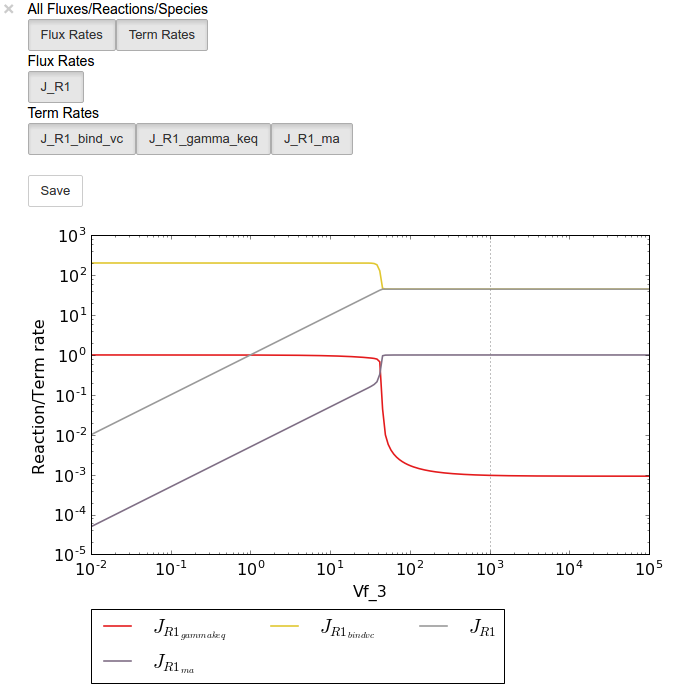
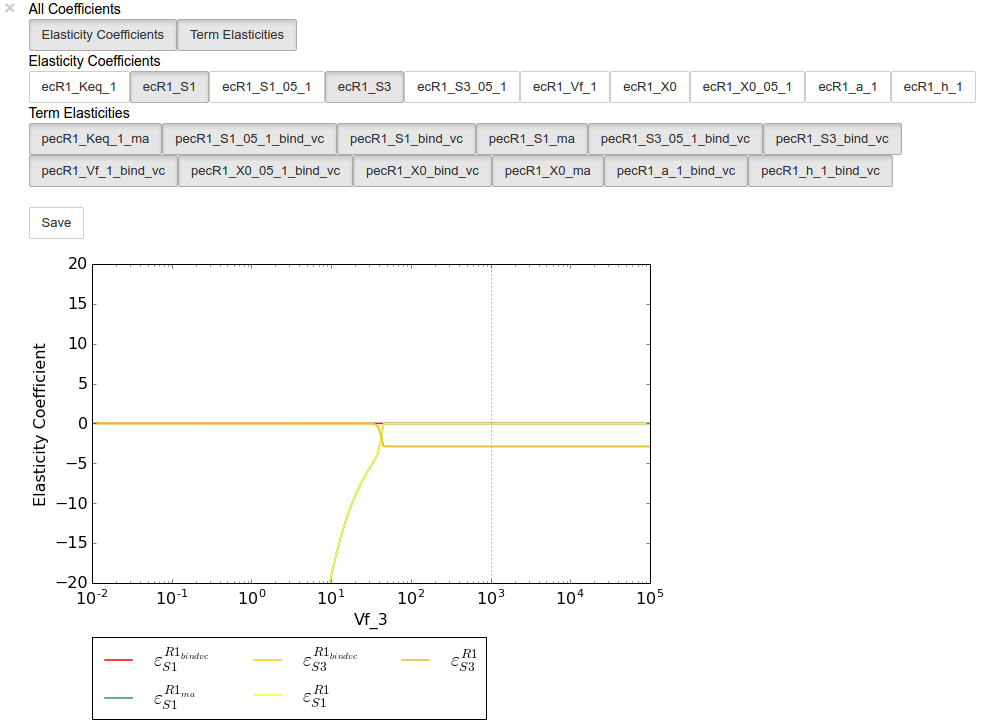

Thermokin
=========

Thermokin is used to assess the kinetic and thermodynamic aspects of
enzyme catalysed reactions in metabolic pathways
`[7,8] <references.html>`__. It provides the functionality to
automatically separate the rate equations of reversible reactions into a
*mass-action* (:math:`v_{ma}`) term and a combined *binding*
(:math:`v_{\Theta}`) and *rate capacity* (:math:`v_{cap}`) term, however
rate equations may be manually split into any arbitrary terms if more
granularity is required. Additionally :math:`\Gamma/K_{eq}` is
calculated automatically for reversible reactions. Subsequently,
elasticity coefficients for the different rate equation terms are
automatically calculated. Similar to symbolic control coefficient and
control pattern expressions of `Symca <Symca.html#>`__, the term and
elasticity expressions generated by Thermokin can be inspected and
manipulated with standard ``SymPy`` functionality and their values are
automatically recalculated upon a steady-state recalculation.

.. note:: Here we use the word "term" to refer to the terms of the
          logarithmic form of a rate equation *as well as to the corresponding
          factors of its linear (conventional) form*. While not technically
          correct, this terminology is used in accordance to the original
          publication `[8] <references.html>`__.

Features
--------

-  Automatically separates rate equations into a mass-action term and a
   combined binding and rate capacity terms.
-  Allows for splitting rate equations into arbitrary terms.
-  Determines a :math:`\Gamma/K_{eq}` expression for reversible
   reactions.
-  Determines elasticity coefficient expressions for each reaction and
   its associated terms.
-  Calculates values of for reaction rate terms, :math:`\Gamma/K_{eq}`,
   and elasticity coefficients when a new steady-state is reached.
-  The effect of a parameter change on the reaction rate terms,
   :math:`\Gamma/K_{eq}`, and elasticity coefficients can be
   investigated by performing a parameter scan and visualised usig
   ``ScanFig``.
-  Loading of split rate equation terms
-  Saving of Thermokin results

Usage and feature walkthrough
-----------------------------

Workflow
~~~~~~~~

Assessing the kinetic and thermodynamic aspects of enzyme catalysed
reactions using ``Thermokin`` requires the following steps:

1. Instantiation of a ``Thermokin`` object using a ``PySCeS`` model
   object and (optionally) a file in which the rate equations of the
   model has been split into separate terms.
2. Accessing rate equation terms via ``reaction_results`` and the
   corresponding reaction name, reaction term name, or
   :math:`\Gamma/K_{eq}` name.
3. Accessing elasticity coefficient terms via ``ec_results`` and the
   corresponding elasticity coefficient name.
4. Inspection of the values of the various terms and elasticity
   coefficients.
5. Inspection of the effect of parameter changes on the values of the
   rate equation terms and elasticity coefficients.
6. Result saving.
7. Further analysis.

Rate term file syntax
~~~~~~~~~~~~~~~~~~~~~

As previously mentioned, Thermokin will attempt to automatically split
the rate equations of reversible reactions into separate terms. While
this feature should work for most common rate equations and does not
require any user intervention or knowledge of the parameter names used
in the model file, it is limited in two significant ways:

1. The algorithm cannot distinguish between the binding and rate
   capacity terms and can therefore not separate them. This is a minor
   issue if the focus of the analysis will be on the elasticity
   coefficients of the different terms, as the combined rate capacity
   and binding term elasticity coefficient will be identical to that of
   the binding term alone.
2. The algorithm cannot separate the effect of single subunit binding
   from that of cooperative binding.

Additionally, the algorithm can fail in some instances.

For these reasons the separate rate equation terms can be manually
defined in a ``.reqn`` file using a relatively simple syntax. Below
follows such a file as automatically generated for the model
``lin4_fb.psc``:

::

    # Automatically parsed and split rate equations for model: lin4_fb.psc
    # generated on: 13:49:07 12-01-2017

    # Note that this is a best effort attempt that is highly dependent
    # on the form of the rate equations as defined in the model file.
    # Check correctness before use.

    # R1 :successful separation of rate equation terms
    !T{R1}{ma} X0 - S1/Keq_1
    !T{R1}{bind_vc} 1.0*Vf_1*(S1/S1_05_1 + X0/X0_05_1)**(h_1 - 1.0)*(a_1*(S3/S3_05_1)**h_1 + 1)/(X0_05_1*(a_1*(S3/S3_05_1)**h_1*(S1/S1_05_1 + X0/X0_05_1)**h_1 + (S3/S3_05_1)**h_1 + (S1/S1_05_1 + X0/X0_05_1)**h_1 + 1))
    !G{R1}{gamma_keq} S1/(Keq_1*X0)

    # R2 :successful separation of rate equation terms
    !T{R2}{ma} S1 - S2/Keq_2
    !T{R2}{bind_vc} 1.0*S2_05_2*Vf_2/(S1*S2_05_2 + S1_05_2*S2 + S1_05_2*S2_05_2)
    !G{R2}{gamma_keq} S2/(Keq_2*S1)

    # R3 :successful separation of rate equation terms
    !T{R3}{ma} S2 - S3/Keq_3
    !T{R3}{bind_vc} 1.0*S3_05_3*Vf_3/(S2*S3_05_3 + S2_05_3*S3 + S2_05_3*S3_05_3)
    !G{R3}{gamma_keq} S3/(Keq_3*S2)

    # R4 :rate equation not included - irreversible or unknown form

Two types of "terms" can be defined in a ``.reqn`` file. The first type
denoted by ``!T``, is factor of the rate equation. When the ``!T`` terms
for a reaction are multiplied together, they should result in the
original rate equation.

Secondly ``!G`` terms are any arbitrary terms that could contain some
useful information. Unlike the ``!T`` terms, the ``!G`` are not subject
to any restrictions in terms of the value of their product or otherwise.
For instance, the ``!G`` terms are used for define :math:`\Gamma/K_{eq}`
for reversible reactions.

The syntax for ``!T`` and ``!G`` terms are as follows:

::

    !T{%reaction_name}{%term_name} %term_expression

    !G{%reaction_name}{%term_name} %term_expression

-  ``%reaction_name`` - The name of the reaction to which the term
   belongs as defined in the ``.psc`` file (see the `PySCeS MDL
   documentation <http://pysces.sourceforge.net/docs/inputfile_doc.html>`__).
-  ``%term_name`` - The name of the term. While this name is arbitrary,
   there can be no duplication for any single reaction.
-  ``%term_expression`` - The expression of the term.

Thus using the example provided above for reaction 3 the line
``!T{R3}{ma} S2 - S3/Keq_3`` specifies a ``!T`` term belonging to
reaction 3 with the name ``ma`` and the expression ``S2 - S3/Keq_3``.

Object instantiation
~~~~~~~~~~~~~~~~~~~~

Instantiation of a ``Thermokin`` analysis object requires ``PySCeS``
model object (``PysMod``) as an argument. Optionally a ``.reqn`` file
can be provided that includes specifically slit rate equations. If path
is provided, ``Thermokin`` will attempt to automatically split the
reversible rate equations as described above and save a ``.reqn`` file
at ``~/Pysces/psc/%model_name.reqn``. If this file already exists,
``ThermiKin`` will load it instead. Using the included
`lin4\_fb.psc <included_files.html#lin4-fb-psc>`__ model a ``Thermokin``
session is instantiated as follows:

``In [1]:``

.. code:: python

    mod = pysces.model('lin4_fb')
    tk = psctb.ThermoKin(mod)

``Out[1]:``

.. parsed-literal::

    Assuming extension is .psc
    Using model directory: /home/jr/Pysces/psc
    /home/jr/Pysces/psc/lin4_fb.psc loading ..... 
    Parsing file: /home/jr/Pysces/psc/lin4_fb.psc
    Info: "X4" has been initialised but does not occur in a rate equation
     
    Calculating L matrix . . . . . . .  done.
    Calculating K matrix . . . . . . .  done.
     

Now that ``ThermoKin`` has automatically generated a ``.reqn`` file for
``lin4_fb.psc``, we can load that file manually during instantiation as
follows:

``In [2]:``

.. code:: python

    # This path leads to the provided rate equation file file 
    path_to_reqn = '~/Pysces/psc/lin4_fb.reqn'
    
    # Correct path depending on platform - necessary for platform independent scripts
    if platform == 'win32' and pysces.version.current_version_tuple() < (0,9,8):
        path_to_reqn = psctb.utils.misc.unix_to_windows_path(path_to_reqn)
    else:
        path_to_reqn = path.expanduser(path_to_reqn)
    
    
    tk = psctb.ThermoKin(mod,path_to_reqn)

If the path specified does not exist, a new ``.reqn`` file will be
generated there instead.

Finally, ``ThermoKin`` can also be forced to regenerate a the ``.reqn``
file by setting the ``overwrite`` argument to ``True``:

``In [3]:``

.. code:: python

    tk = psctb.ThermoKin(mod,overwrite=True)

``Out[3]:``

.. parsed-literal::

    The file /home/jr/Pysces/psc/lin4_fb.reqn will be overwritten with automatically generated file.
    R1        : successful separation of rate equation terms
    R2        : successful separation of rate equation terms
    R3        : successful separation of rate equation terms
    R4        : rate equation not included - irreversible or unknown form

Accessing results
~~~~~~~~~~~~~~~~~

Unlike ``RateChar`` and ``Symca``, ``ThermoKin`` generates results
immediately after instantiation. Results are organised similar to the
other two modules, however, and can be found in the ``reaction_results``
and ``ec_results`` objects:

``In [4]:``

.. code:: python

    tk.reaction_results

.. raw:: html

   

+-----------------------------------+-------------+
| :math:`J_{R1}`                    | 44.618      |
+-----------------------------------+-------------+
| :math:`J_{{R1}_{bindvc}}`         | 44.661      |
+-----------------------------------+-------------+
| :math:`J_{{R1}_{gammakeq}}`       | 9.599e-04   |
+-----------------------------------+-------------+
| :math:`J_{{R1}_{ma}}`             | 0.999       |
+-----------------------------------+-------------+
| :math:`J_{R2}`                    | 44.618      |
+-----------------------------------+-------------+
| :math:`J_{{R2}_{bindvc}}`         | 5081.101    |
+-----------------------------------+-------------+
| :math:`J_{{R2}_{gammakeq}}`       | 0.909       |
+-----------------------------------+-------------+
| :math:`J_{{R2}_{ma}}`             | 0.009       |
+-----------------------------------+-------------+
| :math:`J_{R3}`                    | 44.618      |
+-----------------------------------+-------------+
| :math:`J_{{R3}_{bindvc}}`         | 1036.279    |
+-----------------------------------+-------------+

+-----------------------------------+---------+
| :math:`J_{{R3}_{gammakeq}}`       | 0.951   |
+-----------------------------------+---------+
| :math:`J_{{R3}_{ma}}`             | 0.043   |
+-----------------------------------+---------+

.. raw:: html

   

``In [5]:``

.. code:: python

    tk.ec_results

.. raw:: html

   

+----------------------------------------+--------------+
| :math:`\varepsilon^{R1}_{Keq1}`        | 9.608e-04    |
+----------------------------------------+--------------+
| :math:`\varepsilon^{R1}_{S1}`          | -9.363e-04   |
+----------------------------------------+--------------+
| :math:`\varepsilon^{R1}_{S1051}`       | -2.451e-05   |
+----------------------------------------+--------------+
| :math:`\varepsilon^{R1}_{S3}`          | -2.888       |
+----------------------------------------+--------------+
| :math:`\varepsilon^{R1}_{S3051}`       | 2.888        |
+----------------------------------------+--------------+
| :math:`\varepsilon^{R1}_{Vf1}`         | 1.000        |
+----------------------------------------+--------------+
| :math:`\varepsilon^{R1}_{X0}`          | 3.554        |
+----------------------------------------+--------------+
| :math:`\varepsilon^{R1}_{X0051}`       | -3.553       |
+----------------------------------------+--------------+
| :math:`\varepsilon^{R1}_{a1}`          | 0.062        |
+----------------------------------------+--------------+
| :math:`\varepsilon^{R1}_{h1}`          | -1.461       |
+----------------------------------------+--------------+

+----------------------------------------+-----------+
| :math:`\varepsilon^{R2}_{Keq2}`        | 9.931     |
+----------------------------------------+-----------+
| :math:`\varepsilon^{R2}_{S1}`          | 10.883    |
+----------------------------------------+-----------+
| :math:`\varepsilon^{R2}_{S1052}`       | -0.951    |
+----------------------------------------+-----------+
| :math:`\varepsilon^{R2}_{S2}`          | -10.374   |
+----------------------------------------+-----------+
| :math:`\varepsilon^{R2}_{S2052}`       | 0.443     |
+----------------------------------------+-----------+
| :math:`\varepsilon^{R2}_{Vf2}`         | 1.000     |
+----------------------------------------+-----------+
| :math:`\varepsilon^{R3}_{Keq3}`        | 19.255    |
+----------------------------------------+-----------+
| :math:`\varepsilon^{R3}_{S2}`          | 19.351    |
+----------------------------------------+-----------+
| :math:`\varepsilon^{R3}_{S2053}`       | -0.096    |
+----------------------------------------+-----------+
| :math:`\varepsilon^{R3}_{S3}`          | -19.341   |
+----------------------------------------+-----------+

+------------------------------------------------------+--------------+
| :math:`\varepsilon^{R3}_{S3053}`                     | 0.086        |
+------------------------------------------------------+--------------+
| :math:`\varepsilon^{R3}_{Vf3}`                       | 1.000        |
+------------------------------------------------------+--------------+
| :math:`\varepsilon^{{R1}_{bindvc}}_{Keq1}`           | 0.000        |
+------------------------------------------------------+--------------+
| :math:`\varepsilon^{{R1}_{gammakeq}}_{Keq1}`         | -1.000       |
+------------------------------------------------------+--------------+
| :math:`\varepsilon^{{R1}_{ma}}_{Keq1}`               | 9.608e-04    |
+------------------------------------------------------+--------------+
| :math:`\varepsilon^{{R1}_{bindvc}}_{S1051}`          | -2.451e-05   |
+------------------------------------------------------+--------------+
| :math:`\varepsilon^{{R1}_{gammakeq}}_{S1051}`        | 0.000        |
+------------------------------------------------------+--------------+
| :math:`\varepsilon^{{R1}_{ma}}_{S1051}`              | 0.000        |
+------------------------------------------------------+--------------+
| :math:`\varepsilon^{{R1}_{bindvc}}_{S1}`             | 2.451e-05    |
+------------------------------------------------------+--------------+
| :math:`\varepsilon^{{R1}_{gammakeq}}_{S1}`           | 1.000        |
+------------------------------------------------------+--------------+

+------------------------------------------------------+--------------+
| :math:`\varepsilon^{{R1}_{ma}}_{S1}`                 | -9.608e-04   |
+------------------------------------------------------+--------------+
| :math:`\varepsilon^{{R1}_{bindvc}}_{S3051}`          | 2.888        |
+------------------------------------------------------+--------------+
| :math:`\varepsilon^{{R1}_{gammakeq}}_{S3051}`        | 0.000        |
+------------------------------------------------------+--------------+
| :math:`\varepsilon^{{R1}_{ma}}_{S3051}`              | 0.000        |
+------------------------------------------------------+--------------+
| :math:`\varepsilon^{{R1}_{bindvc}}_{S3}`             | -2.888       |
+------------------------------------------------------+--------------+
| :math:`\varepsilon^{{R1}_{gammakeq}}_{S3}`           | 0.000        |
+------------------------------------------------------+--------------+
| :math:`\varepsilon^{{R1}_{ma}}_{S3}`                 | 0.000        |
+------------------------------------------------------+--------------+
| :math:`\varepsilon^{{R1}_{bindvc}}_{Vf1}`            | 1.000        |
+------------------------------------------------------+--------------+
| :math:`\varepsilon^{{R1}_{gammakeq}}_{Vf1}`          | 0.000        |
+------------------------------------------------------+--------------+
| :math:`\varepsilon^{{R1}_{ma}}_{Vf1}`                | 0.000        |
+------------------------------------------------------+--------------+

+------------------------------------------------------+----------+
| :math:`\varepsilon^{{R1}_{bindvc}}_{X0051}`          | -3.553   |
+------------------------------------------------------+----------+
| :math:`\varepsilon^{{R1}_{gammakeq}}_{X0051}`        | 0.000    |
+------------------------------------------------------+----------+
| :math:`\varepsilon^{{R1}_{ma}}_{X0051}`              | 0.000    |
+------------------------------------------------------+----------+
| :math:`\varepsilon^{{R1}_{bindvc}}_{X0}`             | 2.553    |
+------------------------------------------------------+----------+
| :math:`\varepsilon^{{R1}_{gammakeq}}_{X0}`           | -1.000   |
+------------------------------------------------------+----------+
| :math:`\varepsilon^{{R1}_{ma}}_{X0}`                 | 1.001    |
+------------------------------------------------------+----------+
| :math:`\varepsilon^{{R1}_{bindvc}}_{a1}`             | 0.062    |
+------------------------------------------------------+----------+
| :math:`\varepsilon^{{R1}_{gammakeq}}_{a1}`           | 0.000    |
+------------------------------------------------------+----------+
| :math:`\varepsilon^{{R1}_{ma}}_{a1}`                 | 0.000    |
+------------------------------------------------------+----------+
| :math:`\varepsilon^{{R1}_{bindvc}}_{h1}`             | -1.461   |
+------------------------------------------------------+----------+

+------------------------------------------------------+----------+
| :math:`\varepsilon^{{R1}_{gammakeq}}_{h1}`           | 0.000    |
+------------------------------------------------------+----------+
| :math:`\varepsilon^{{R1}_{ma}}_{h1}`                 | 0.000    |
+------------------------------------------------------+----------+
| :math:`\varepsilon^{{R2}_{bindvc}}_{Keq2}`           | 0.000    |
+------------------------------------------------------+----------+
| :math:`\varepsilon^{{R2}_{gammakeq}}_{Keq2}`         | -1.000   |
+------------------------------------------------------+----------+
| :math:`\varepsilon^{{R2}_{ma}}_{Keq2}`               | 9.931    |
+------------------------------------------------------+----------+
| :math:`\varepsilon^{{R2}_{bindvc}}_{S1052}`          | -0.951   |
+------------------------------------------------------+----------+
| :math:`\varepsilon^{{R2}_{gammakeq}}_{S1052}`        | 0.000    |
+------------------------------------------------------+----------+
| :math:`\varepsilon^{{R2}_{ma}}_{S1052}`              | 0.000    |
+------------------------------------------------------+----------+
| :math:`\varepsilon^{{R2}_{bindvc}}_{S1}`             | -0.049   |
+------------------------------------------------------+----------+
| :math:`\varepsilon^{{R2}_{gammakeq}}_{S1}`           | -1.000   |
+------------------------------------------------------+----------+

+------------------------------------------------------+----------+
| :math:`\varepsilon^{{R2}_{ma}}_{S1}`                 | 10.931   |
+------------------------------------------------------+----------+
| :math:`\varepsilon^{{R2}_{bindvc}}_{S2052}`          | 0.443    |
+------------------------------------------------------+----------+
| :math:`\varepsilon^{{R2}_{gammakeq}}_{S2052}`        | 0.000    |
+------------------------------------------------------+----------+
| :math:`\varepsilon^{{R2}_{ma}}_{S2052}`              | 0.000    |
+------------------------------------------------------+----------+
| :math:`\varepsilon^{{R2}_{bindvc}}_{S2}`             | -0.443   |
+------------------------------------------------------+----------+
| :math:`\varepsilon^{{R2}_{gammakeq}}_{S2}`           | 1.000    |
+------------------------------------------------------+----------+
| :math:`\varepsilon^{{R2}_{ma}}_{S2}`                 | -9.931   |
+------------------------------------------------------+----------+
| :math:`\varepsilon^{{R2}_{bindvc}}_{Vf2}`            | 1.000    |
+------------------------------------------------------+----------+
| :math:`\varepsilon^{{R2}_{gammakeq}}_{Vf2}`          | 0.000    |
+------------------------------------------------------+----------+
| :math:`\varepsilon^{{R2}_{ma}}_{Vf2}`                | 0.000    |
+------------------------------------------------------+----------+

+------------------------------------------------------+----------+
| :math:`\varepsilon^{{R3}_{bindvc}}_{Keq3}`           | 0.000    |
+------------------------------------------------------+----------+
| :math:`\varepsilon^{{R3}_{gammakeq}}_{Keq3}`         | -1.000   |
+------------------------------------------------------+----------+
| :math:`\varepsilon^{{R3}_{ma}}_{Keq3}`               | 19.255   |
+------------------------------------------------------+----------+
| :math:`\varepsilon^{{R3}_{bindvc}}_{S2053}`          | -0.096   |
+------------------------------------------------------+----------+
| :math:`\varepsilon^{{R3}_{gammakeq}}_{S2053}`        | 0.000    |
+------------------------------------------------------+----------+
| :math:`\varepsilon^{{R3}_{ma}}_{S2053}`              | 0.000    |
+------------------------------------------------------+----------+
| :math:`\varepsilon^{{R3}_{bindvc}}_{S2}`             | -0.904   |
+------------------------------------------------------+----------+
| :math:`\varepsilon^{{R3}_{gammakeq}}_{S2}`           | -1.000   |
+------------------------------------------------------+----------+
| :math:`\varepsilon^{{R3}_{ma}}_{S2}`                 | 20.255   |
+------------------------------------------------------+----------+
| :math:`\varepsilon^{{R3}_{bindvc}}_{S3053}`          | 0.086    |
+------------------------------------------------------+----------+

+------------------------------------------------------+-----------+
| :math:`\varepsilon^{{R3}_{gammakeq}}_{S3053}`        | 0.000     |
+------------------------------------------------------+-----------+
| :math:`\varepsilon^{{R3}_{ma}}_{S3053}`              | 0.000     |
+------------------------------------------------------+-----------+
| :math:`\varepsilon^{{R3}_{bindvc}}_{S3}`             | -0.086    |
+------------------------------------------------------+-----------+
| :math:`\varepsilon^{{R3}_{gammakeq}}_{S3}`           | 1.000     |
+------------------------------------------------------+-----------+
| :math:`\varepsilon^{{R3}_{ma}}_{S3}`                 | -19.255   |
+------------------------------------------------------+-----------+
| :math:`\varepsilon^{{R3}_{bindvc}}_{Vf3}`            | 1.000     |
+------------------------------------------------------+-----------+
| :math:`\varepsilon^{{R3}_{gammakeq}}_{Vf3}`          | 0.000     |
+------------------------------------------------------+-----------+
| :math:`\varepsilon^{{R3}_{ma}}_{Vf3}`                | 0.000     |
+------------------------------------------------------+-----------+

.. raw:: html

   

Each results object contains a variety of fields containing data related
to a specific term or expression and may be accessed in a similar way to
the results of ``Symca``:

-  Inspecting an individual reactions, terms, or elasticity coefficient
   yields a symbolic expression together with a value

``In [6]:``

.. code:: python

    # The binding*v_cap term of reaction 1
    tk.reaction_results.J_R1_bind_vc

.. math::

    J_{{R1}_{bindvc}} = \frac{1.0 \cdot Vf_{1} \cdot \left(\frac{S_{1}}{S_{1051}} + \frac{X_{0}}{X_{0051}}\right)^{h_{1} - 1.0} \cdot \left(a_{1} \cdot \left(\frac{S_{3}}{S_{3051}}\right)^{h_{1}} + 1\right)}{X_{0051} \cdot \left(a_{1} \cdot \left(\frac{S_{3}}{S_{3051}}\right)^{h_{1}} \cdot \left(\frac{S_{1}}{S_{1051}} + \frac{X_{0}}{X_{0051}}\right)^{h_{1}} + \left(\frac{S_{3}}{S_{3051}}\right)^{h_{1}} + \left(\frac{S_{1}}{S_{1051}} + \frac{X_{0}}{X_{0051}}\right)^{h_{1}} + 1\right)} = 44.661

-  ``SymPy`` expressions can be accessed via the ``expression`` field

``In [7]:``

.. code:: python

    tk.reaction_results.J_R1_bind_vc.expression

.. math::

    \displaystyle \frac{1.0 Vf_{1} \left(\frac{S_{1}}{S_{1 05 1}} + \frac{X_{0}}{X_{0 05 1}}\right)^{h_{1} - 1.0} \left(a_{1} \left(\frac{S_{3}}{S_{3 05 1}}\right)^{h_{1}} + 1\right)}{X_{0 05 1} \left(a_{1} \left(\frac{S_{3}}{S_{3 05 1}}\right)^{h_{1}} \left(\frac{S_{1}}{S_{1 05 1}} + \frac{X_{0}}{X_{0 05 1}}\right)^{h_{1}} + \left(\frac{S_{3}}{S_{3 05 1}}\right)^{h_{1}} + \left(\frac{S_{1}}{S_{1 05 1}} + \frac{X_{0}}{X_{0 05 1}}\right)^{h_{1}} + 1\right)}

-  Values of the reaction, term, or elasticity coefficients

``In [8]:``

.. code:: python

    tk.reaction_results.J_R1_bind_vc.value

``Out[8]:``

.. parsed-literal::

    44.66092105160845

Additionally the ``latex_name``, ``latex_expression``, and parent model
``mod`` can also be accessed

In order to promote a logical and exploratory approach to investigating
data generated by ``ThermoKin``, the results are also arranged in a
manner in which terms and elasticity coefficients associated with a
certain reaction can be found nested within the results for that
reaction. Using reaction 1 (called ``J_R1`` to signify the fact that its
rate is at steady state) as an example, results can also be accessed in
the following manner:

``In [9]:``

.. code:: python

    # The reaction can also be accessed at the root level of the ThermoKin object
    # and the binding*v_cap term is nested under it.
    tk.J_R1.bind_vc

.. math::

    J_{{R1}_{bindvc}} = \frac{1.0 \cdot Vf_{1} \cdot \left(\frac{S_{1}}{S_{1051}} + \frac{X_{0}}{X_{0051}}\right)^{h_{1} - 1.0} \cdot \left(a_{1} \cdot \left(\frac{S_{3}}{S_{3051}}\right)^{h_{1}} + 1\right)}{X_{0051} \cdot \left(a_{1} \cdot \left(\frac{S_{3}}{S_{3051}}\right)^{h_{1}} \cdot \left(\frac{S_{1}}{S_{1051}} + \frac{X_{0}}{X_{0051}}\right)^{h_{1}} + \left(\frac{S_{3}}{S_{3051}}\right)^{h_{1}} + \left(\frac{S_{1}}{S_{1051}} + \frac{X_{0}}{X_{0051}}\right)^{h_{1}} + 1\right)} = 44.661

``In [10]:``

.. code:: python

    # A reaction or term specific ec_results object is also available
    tk.J_R1.bind_vc.ec_results.pecR1_X0_bind_vc

.. math::

    \varepsilon^{{R1}_{bindvc}}_{X0} = - \frac{1.0 \cdot S_{1051} \cdot X_{0} \cdot \left(\frac{S_{1}}{S_{1051}} + \frac{X_{0}}{X_{0051}}\right)^{1.0 - h_{1}} \cdot \left(\frac{S_{1}}{S_{1051}} + \frac{X_{0}}{X_{0051}}\right)^{h_{1} - 1.0} \cdot \left(1.0 \cdot a_{1} \cdot \left(\frac{S_{3}}{S_{3051}}\right)^{h_{1}} \cdot \left(\frac{S_{1}}{S_{1051}} + \frac{X_{0}}{X_{0051}}\right)^{h_{1}} - 1.0 \cdot h_{1} \cdot \left(\frac{S_{3}}{S_{3051}}\right)^{h_{1}} - 1.0 \cdot h_{1} + 1.0 \cdot \left(\frac{S_{3}}{S_{3051}}\right)^{h_{1}} + 1.0 \cdot \left(\frac{S_{1}}{S_{1051}} + \frac{X_{0}}{X_{0051}}\right)^{h_{1}} + 1.0\right)}{\left(S_{1} \cdot X_{0051} + S_{1051} \cdot X_{0}\right) \cdot \left(a_{1} \cdot \left(\frac{S_{3}}{S_{3051}}\right)^{h_{1}} \cdot \left(\frac{S_{1}}{S_{1051}} + \frac{X_{0}}{X_{0051}}\right)^{h_{1}} + \left(\frac{S_{3}}{S_{3051}}\right)^{h_{1}} + \left(\frac{S_{1}}{S_{1051}} + \frac{X_{0}}{X_{0051}}\right)^{h_{1}} + 1\right)} = 2.553

``In [11]:``

.. code:: python

    # All the terms of a specific reaction can be accessed via `terms`
    tk.J_R1.terms

.. raw:: html

   

+-----------------------------------+-------------+
| :math:`J_{{R1}_{bindvc}}`         | 44.661      |
+-----------------------------------+-------------+
| :math:`J_{{R1}_{gammakeq}}`       | 9.599e-04   |
+-----------------------------------+-------------+
| :math:`J_{{R1}_{ma}}`             | 0.999       |
+-----------------------------------+-------------+

.. raw:: html

   

While each reaction/term/elasticity coefficient may be accessed in
multiple ways, these fields are all references to the same result
object. Modifying a term accessed in one way, therefore affects all
references to the object.

Dynamic value updating
~~~~~~~~~~~~~~~~~~~~~~

The values of the reactions/terms/elasticity coefficients are
automatically updated when a new steady state is calculated for the
model. Thus changing a parameter of ``lin4_hill``, such as the
:math:`V_{f}` value of reaction 3, will lead to new values:

``In [12]:``

.. code:: python

    # Original value of J_R3
    tk.J_R3

.. math::

    J_{R3} = \frac{1.0 \cdot S_{3053} \cdot Vf_{3} \cdot \left(Keq_{3} \cdot S_{2} - S_{3}\right)}{Keq_{3} \cdot \left(S_{2} \cdot S_{3053} + S_{2053} \cdot S_{3} + S_{2053} \cdot S_{3053}\right)} = 44.618

``In [13]:``

.. code:: python

    mod.reLoad()
    # mod.Vf_3 has a default value of 1000
    mod.Vf_3 = 0.1
    # calculating new steady state
    mod.doState()

``Out[13]:``

.. parsed-literal::

    
    Parsing file: /home/jr/Pysces/psc/lin4_fb.psc
    Info: "X4" has been initialised but does not occur in a rate equation
     
    Calculating L matrix . . . . . . .  done.
    Calculating K matrix . . . . . . .  done.
     
    INFO: (hybrd) Invalid steady state:
    (hybrd) The iteration is not making good progress, as measured by the 
      improvement from the last ten iterations.
    WARNING!! Negative concentrations detected.
    INFO: STATE is switching to NLEQ2 solver.
    (nleq2) The solution converged.

``In [14]:``

.. code:: python

    # New value (original was 44.618)
    tk.J_R3

.. math::

    J_{R3} = \frac{1.0 \cdot S_{3053} \cdot Vf_{3} \cdot \left(Keq_{3} \cdot S_{2} - S_{3}\right)}{Keq_{3} \cdot \left(S_{2} \cdot S_{3053} + S_{2053} \cdot S_{3} + S_{2053} \cdot S_{3053}\right)} = 0.100

``In [15]:``

.. code:: python

    # resetting to default Vf_3 value and recalculating
    mod.reLoad()
    mod.doState()

``Out[15]:``

.. parsed-literal::

    
    Parsing file: /home/jr/Pysces/psc/lin4_fb.psc
    Info: "X4" has been initialised but does not occur in a rate equation
     
    Calculating L matrix . . . . . . .  done.
    Calculating K matrix . . . . . . .  done.
     
    (hybrd) The solution converged.

Parameter scans
~~~~~~~~~~~~~~~

Parameter scans can be performed in order to determine the effect of a
parameter change on a reaction rate and its individual terms or on the
elasticity coefficients relating to a particular reaction and its
related term elasticity coefficients (denoted as
``pec%reaction_%modifier_%term`` see `Basic Usage -
Syntax <basic_usage.html#syntax>`__) . The procedures for both the
"value" and "elasticity" scans are very much the same and rely on the
same principles as described under `Basic Usage - Plotting and
Displaying
Results <basic_usage.html#plotting-and-displaying-results>`__.

To perform a parameter scan the ``do_par_scan`` method is called. This
method has the following arguments:

-  ``parameter``: A String representing the parameter which should be
   varied.
-  ``scan_range``: Any iterable representing the range of values over
   which to vary the parameter (typically a NumPy ``ndarray`` generated
   by ``numpy.linspace`` or ``numpy.logspace``).
-  ``scan_type``: Either ``"elasticity"`` or ``"value"`` as described
   above (*default*: ``"value"``).
-  ``init_return``: If ``True`` the parameter value will be reset to its
   initial value after performing the parameter scan (*default*:
   ``True``).
-  ``par_scan``: If ``True``, the parameter scan will be performed by
   multiple parallel processes rather than a single process, thus
   speeding performance (*default*: ``False``).
-  ``par_engine``: Specifies the engine to be used for the parallel
   scanning processes. Can either be ``"multiproc"`` or ``"ipcluster"``.
   A discussion of the differences between these methods are beyond the
   scope of this document, see
   `here <http://www.davekuhlman.org/python_multiprocessing_01.html>`__
   for a brief overview of Multiprocessing in Python. (*default*:
   ``"multiproc"``).

Below we will perform a value scan of the effect of :math:`V_{f^3}` on
the terms of reaction 1 for 200 points between 0.01 and 100000 in log
space:

``In [16]:``

.. code:: python

    valscan = tk.J_R1.do_par_scan('Vf_3',scan_range=numpy.logspace(-2,5,200),scan_type='value')

``Out[16]:``

.. parsed-literal::

    MaxMode 0
    0 min 0 sec
    SCANNER: Tsteps 200
    
    SCANNER: 200 states analysed
    
    (hybrd) The solution converged.

``In [17]:``

.. code:: python

    valplot = valscan.plot()
    
    # Equivalent to clicking the corresponding buttons
    valplot.toggle_category('J_R1', True)
    valplot.toggle_category('J_R1_bind_vc', True)
    valplot.toggle_category('J_R1_gamma_keq', True)
    valplot.toggle_category('J_R1_ma', True)
    
    valplot.interact()

Similarly, we can perform an elasticity scan using the same parameters:

``In [18]:``

.. code:: python

    ecscan = tk.J_R1.do_par_scan('Vf_3',scan_range=numpy.logspace(-2,5,200),scan_type='elasticity')

``Out[18]:``

.. parsed-literal::

    MaxMode 0
    0 min 0 sec
    SCANNER: Tsteps 200
    
    SCANNER: 200 states analysed
    
    (hybrd) The solution converged.

.. note:: Elasticity coefficients with expression equal to zero (which
          will by definition have zero values regardless of any parameter values)
          are ommitted from the parameter scan results even though they are
          included in the ``ec_results`` objects.

``In [19]:``

.. code:: python

    ecplot = ecscan.plot()
    
    # All term elasticity coefficients are enabled
    # by default, thus only the "full" elasticity 
    # coefficients need to be enabled. Here we
    # switch on the elasticity coefficients 
    # representing the sensitivity of R1 with 
    # respect to the substrate S1 and the inhibitor
    # S3.
    ecplot.toggle_category('ecR1_S1', True)
    ecplot.toggle_category('ecR1_S3', True)
    
    # The y limits are adjusted below as the elasticity 
    # values of this parameter scan have extremely
    # large magnitudes at low Vf_3 values
    ecplot.ax.set_ylim((-20,20))
    
    ecplot.interact()

Saving results
~~~~~~~~~~~~~~

In addition to being able to save parameter scan results (as previously
described in `Basic Usage - ScanFig <basic_usage.html#scanfig>`__), a
summary of the results found in ``reaction_results`` and ``ec_results``
can be saved using the ``save_results`` method. This saves a ``csv``
file (by default) to disk to any specified location. If no location is
specified, a file named ``tk_summary_N`` is saved to the
``~/Pysces/$modelname/thermokin/`` directory, where ``N`` is a number
starting at 0:

``In [20]:``

.. code:: python

    tk.save_results()

``save_results`` has the following optional arguments:

-  ``file_name``: Specifies a path to save the results to. If ``None``,
   the path defaults as described above.
-  ``separator``: The separator between fields (*default*: ``","``)

The contents of the saved data file is as follows:

``In [21]:``

.. code:: python

    # the following code requires `pandas` to run
    import pandas as pd
    # load csv file at default path
    results_path = '~/Pysces/lin4_fb/thermokin/tk_summary_0.csv'
    
    # Correct path depending on platform - necessary for platform independent scripts
    if platform == 'win32' and pysces.version.current_version_tuple() < (0,9,8):
        results_path = psctb.utils.misc.unix_to_windows_path(results_path)
    else:
        results_path = path.expanduser(results_path)
    
    saved_results = pd.read_csv(results_path)
    
    
    # show first 20 lines
    saved_results.head(n=20) 

.. raw:: html

   

.. raw:: html

   

    
    <table border="1" class="dataframe">
      <thead>
        <tr style="text-align: right;">
          <th></th>
          <th># name</th>
          <th>value</th>
          <th>latex_name</th>
          <th>latex_expression</th>
        </tr>
      </thead>
      <tbody>
        <tr>
          <th>0</th>
          <td>J_R1</td>
          <td>44.618051</td>
          <td>J_{R1}</td>
          <td>\frac{1.0 \cdot Vf_{1} \cdot \left(Keq_{1} \cd...</td>
        </tr>
        <tr>
          <th>1</th>
          <td>J_R1_bind_vc</td>
          <td>44.660921</td>
          <td>J_{{R1}_{bindvc}}</td>
          <td>\frac{1.0 \cdot Vf_{1} \cdot \left(\frac{S_{1}...</td>
        </tr>
        <tr>
          <th>2</th>
          <td>J_R1_gamma_keq</td>
          <td>0.000960</td>
          <td>J_{{R1}_{gammakeq}}</td>
          <td>\frac{S_{1}}{Keq_{1} \cdot X_{0}}</td>
        </tr>
        <tr>
          <th>3</th>
          <td>J_R1_ma</td>
          <td>0.999040</td>
          <td>J_{{R1}_{ma}}</td>
          <td>\frac{Keq_{1} \cdot X_{0} - S_{1}}{Keq_{1}}</td>
        </tr>
        <tr>
          <th>4</th>
          <td>J_R2</td>
          <td>44.618051</td>
          <td>J_{R2}</td>
          <td>\frac{1.0 \cdot S_{2052} \cdot Vf_{2} \cdot \l...</td>
        </tr>
        <tr>
          <th>5</th>
          <td>J_R2_bind_vc</td>
          <td>5081.100949</td>
          <td>J_{{R2}_{bindvc}}</td>
          <td>\frac{1.0 \cdot S_{2052} \cdot Vf_{2}}{S_{1} \...</td>
        </tr>
        <tr>
          <th>6</th>
          <td>J_R2_gamma_keq</td>
          <td>0.908520</td>
          <td>J_{{R2}_{gammakeq}}</td>
          <td>\frac{S_{2}}{Keq_{2} \cdot S_{1}}</td>
        </tr>
        <tr>
          <th>7</th>
          <td>J_R2_ma</td>
          <td>0.008781</td>
          <td>J_{{R2}_{ma}}</td>
          <td>\frac{Keq_{2} \cdot S_{1} - S_{2}}{Keq_{2}}</td>
        </tr>
        <tr>
          <th>8</th>
          <td>J_R3</td>
          <td>44.618051</td>
          <td>J_{R3}</td>
          <td>\frac{1.0 \cdot S_{3053} \cdot Vf_{3} \cdot \l...</td>
        </tr>
        <tr>
          <th>9</th>
          <td>J_R3_bind_vc</td>
          <td>1036.279489</td>
          <td>J_{{R3}_{bindvc}}</td>
          <td>\frac{1.0 \cdot S_{3053} \cdot Vf_{3}}{S_{2} \...</td>
        </tr>
        <tr>
          <th>10</th>
          <td>J_R3_gamma_keq</td>
          <td>0.950629</td>
          <td>J_{{R3}_{gammakeq}}</td>
          <td>\frac{S_{3}}{Keq_{3} \cdot S_{2}}</td>
        </tr>
        <tr>
          <th>11</th>
          <td>J_R3_ma</td>
          <td>0.043056</td>
          <td>J_{{R3}_{ma}}</td>
          <td>\frac{Keq_{3} \cdot S_{2} - S_{3}}{Keq_{3}}</td>
        </tr>
        <tr>
          <th>12</th>
          <td>ecR1_Keq_1</td>
          <td>0.000961</td>
          <td>\varepsilon^{R1}_{Keq1}</td>
          <td>\frac{1.0 \cdot S_{1} \cdot \left(\frac{S_{1}}...</td>
        </tr>
        <tr>
          <th>13</th>
          <td>pecR1_Keq_1_bind_vc</td>
          <td>0.000000</td>
          <td>\varepsilon^{{R1}_{bindvc}}_{Keq1}</td>
          <td>0</td>
        </tr>
        <tr>
          <th>14</th>
          <td>pecR1_Keq_1_gamma_keq</td>
          <td>-1.000000</td>
          <td>\varepsilon^{{R1}_{gammakeq}}_{Keq1}</td>
          <td>-1</td>
        </tr>
        <tr>
          <th>15</th>
          <td>pecR1_Keq_1_ma</td>
          <td>0.000961</td>
          <td>\varepsilon^{{R1}_{ma}}_{Keq1}</td>
          <td>\frac{S_{1}}{Keq_{1} \cdot X_{0} - S_{1}}</td>
        </tr>
        <tr>
          <th>16</th>
          <td>ecR1_S1</td>
          <td>-0.000936</td>
          <td>\varepsilon^{R1}_{S1}</td>
          <td>- \frac{1.0 \cdot S_{1} \cdot \left(\frac{S_{1...</td>
        </tr>
        <tr>
          <th>17</th>
          <td>ecR1_S1_05_1</td>
          <td>-0.000025</td>
          <td>\varepsilon^{R1}_{S1051}</td>
          <td>\frac{1.0 \cdot S_{1} \cdot X_{0051} \cdot \le...</td>
        </tr>
        <tr>
          <th>18</th>
          <td>pecR1_S1_05_1_bind_vc</td>
          <td>-0.000025</td>
          <td>\varepsilon^{{R1}_{bindvc}}_{S1051}</td>
          <td>\frac{1.0 \cdot S_{1} \cdot X_{0051} \cdot \le...</td>
        </tr>
        <tr>
          <th>19</th>
          <td>pecR1_S1_05_1_gamma_keq</td>
          <td>0.000000</td>
          <td>\varepsilon^{{R1}_{gammakeq}}_{S1051}</td>
          <td>0</td>
        </tr>
      </tbody>
    </table>
    

