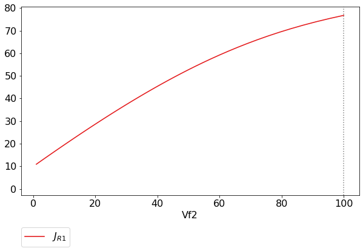
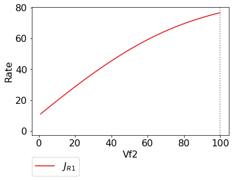

Basic Usage
===========

This section gives a quick overview of some features and conventions
that are common to all the main analysis tools. While the main analysis
tools will be briefly referenced here, later sections will cover them in
full.

Syntax
------

As PySCeSToolbox was designed to work on top of PySCeS, many of its
conventions are employed in this project. The syntax (or naming scheme)
for referring to model variables and parameters is the most obvious
legacy. Syntax is briefly described in the table below and relates to
the provided `example model <included_files.html#example-model-psc>`__
(for input file syntax refer to the `PySCeS model descriptor language
documentation <http://pysces.sourceforge.net/docs/inputfile_doc.html>`__):

+--------------------------------------------+-------------------------------------------------------------------+-------------------------+-------------------------------------------------------------------+
| Description                                | Syntax description                                                | PySCeS example          | Rendered LaTeX example                                            |
+============================================+===================================================================+=========================+===================================================================+
| Parameters                                 | As defined in model file                                          | Keq2                    | :math:`Keq2`                                                      |
+--------------------------------------------+-------------------------------------------------------------------+-------------------------+-------------------------------------------------------------------+
| Species                                    | As defined in model file                                          | S1                      | :math:`S1`                                                        |
+--------------------------------------------+-------------------------------------------------------------------+-------------------------+-------------------------------------------------------------------+
| Reactions                                  | As defined in model file                                          | R1                      | :math:`R1`                                                        |
+--------------------------------------------+-------------------------------------------------------------------+-------------------------+-------------------------------------------------------------------+
| Steady state species                       | “\_ss” appended to model definition                               | S1\_ss                  | :math:`S1_{ss}`                                                   |
+--------------------------------------------+-------------------------------------------------------------------+-------------------------+-------------------------------------------------------------------+
| Steady state reaction rates (Flux)         | “J\_” prepended to model definition                               | J\_R1                   | :math:`J_{R1}`                                                    |
+--------------------------------------------+-------------------------------------------------------------------+-------------------------+-------------------------------------------------------------------+
| Control coefficients                       | In the format “ccJreaction\_reaction”                             | ccJR1\_R2               | :math:`C^{JR1}_{R2}`                                              |
+--------------------------------------------+-------------------------------------------------------------------+-------------------------+-------------------------------------------------------------------+
| Elasticity coefficients                    | In the format “ecreaction\_modifier”                              | ecR1\_S1 or ecR2\_Vf1   | :math:`\varepsilon^{R1}_{S1}` or :math:`\varepsilon^{R2}_{Vf2}`   |
+--------------------------------------------+-------------------------------------------------------------------+-------------------------+-------------------------------------------------------------------+
| Response coefficients                      | In the format “rcJreaction\_parameter”                            | rcJR3\_Vf3              | :math:`R^{JR3}_{Vf3}`                                             |
+--------------------------------------------+-------------------------------------------------------------------+-------------------------+-------------------------------------------------------------------+
| Partial response coefficients              | In the format “prcJreaction\_parameter\_reaction”                 | prcJR3\_X2\_R2          | :math:`^{R2}R^{JR3}_{X2}`                                         |
+--------------------------------------------+-------------------------------------------------------------------+-------------------------+-------------------------------------------------------------------+
| Control patterns                           | CPn where n is an number assigned to a specific control pattern   | CP4                     | :math:`CP4`                                                       |
+--------------------------------------------+-------------------------------------------------------------------+-------------------------+-------------------------------------------------------------------+
| Flux contribution by specific term         | In the format "J\_reaction\_term"                                 | J\_R1\_binding          | :math:`J_{R1_{binding}}`                                          |
+--------------------------------------------+-------------------------------------------------------------------+-------------------------+-------------------------------------------------------------------+
| Elasticity contribution by specific term   | In the format "pecreaction\_modifier\_term"                       | pecR1\_S1\_binding      | :math:`\varepsilon^{R1_{binding}}_{S1}`                           |
+--------------------------------------------+-------------------------------------------------------------------+-------------------------+-------------------------------------------------------------------+

.. note:: Any underscores (\_) in model defined variables or parameters
          will be removed when rendering to LaTeX to ensure consistency.

Saving and Default Directories
------------------------------

Whenever any analysis tool is used for the first time on a specific
model, a directory is created within the PySCeS output directory that
corresponds to the model name. A second directory which corresponds to
the analysis tool name will be created within the first. These
directories serve a dual purpose:

The fist, and most pertinent to the user, is for providing a default
location for saving results. PySCeSToolbox allows users to save results
to any arbitrary location on the file system, however when no location
is provided, results will be saved to the default directory
corresponding to the model name and analysis method as described above.
We consider this a fairly intuitive and convenient system that is
especially useful for outputting small sets of results. Result saving
functionality is usually provided by a ``save_results`` method for each
respective analysis tool. Exceptions are ``RateChar`` where multiple
types of results may be saved, each with their own method, and
``ScanFig`` where figures are saved simply with a ``save`` method.

The second purpose is to provide a location for writing temporary files
and internal data that is used to save “analysis sessions” for later
loading. In this case specifying the output destination is not supported
in most cases and these features depend on the default directory.
Session saving functionality is provided only for tools that take
significant amounts of time to generate results and will always be
provided by a ``save_session`` method and a corresponding
``load_session`` method will read these results from disk.

.. note:: Depending on your OS the default PySCeS directory will be
          either ``~/Pysces`` or ``C:\Pysces``. PySCeSToolbox will therefore
          create the following type of folder structure:
          ``~/Pysces/model_name/analysis_method/`` or
          ``C:\Pysces\model_name\analysis_method\``

Plotting and Displaying Results
-------------------------------

As already mentioned previously, PySCeSToolbox includes the
functionality to plot results generated by its tools. Typically these
plots will either contain results from a parameter scan where some
metabolic variables are plotted against a change in parameter, or they
will contain results from a time simulation where the evolution of
metabolic variables over a certain time period are plotted.

Data2D
~~~~~~

The ``Data2D`` class provides functionality for capturing raw parameter
scan/simulation results and provides an interface to the actual plotting
tool ``ScanFig.`` It is used internally by other tools in PySCeSToolbox
and a ``Data2D`` object will be created and returned automatically after
performing a parameter scan with any of the ``do_par_scan`` methods
provided by these tools.

Features
^^^^^^^^

-  Access to scan/simulation results through its ``scan_results``
   dictionary.
-  The ability to save results in the form of a ``csv`` file using the
   ``save_results`` method.
-  The ability to generate a ``ScanFig`` object via the ``plot`` method.

Usage example
^^^^^^^^^^^^^

Below is an usage example of Data2D, where results from a PySCeS
parameter scan are saved to a object.

``In [1]:``

.. code:: python

    # PySCeS model instantiation using the `example_model.py` file
    # with name `mod`
    mod = pysces.model('example_model')
    mod.SetQuiet()
    
    # Parameter scan setup and execution
    # Here we are changing the value of `Vf2` over logarithmic
    # scale from `log10(1)` (or 0) to log10(100) (or 2) for a
    # 100 points. 
    mod.scan_in = 'Vf2'
    mod.scan_out = ['J_R1','J_R2','J_R3']
    mod.Scan1(numpy.logspace(0,2,100))
    
    # Instantiation of `Data2D` object with name `scan_data`
    column_names = [mod.scan_in] + mod.scan_out
    
    scan_data = psctb.utils.plotting.Data2D(mod=mod,
                                            column_names=column_names,
                                            data_array=mod.scan_res)

``Out[1]:``

.. parsed-literal::

    Assuming extension is .psc
    Using model directory: /home/carl/Pysces/psc
    /home/carl/Pysces/psc/example_model.psc loading ..... 
    Parsing file: /home/carl/Pysces/psc/example_model.psc
     
    Calculating L matrix . . . . . . .  done.
    Calculating K matrix . . . . . . .  done.
     
    
    Scanning ...
    100 80 60 40 20 0 
    done.
    

Results that can be accessed via ``scan_results``:

``In [2]:``

.. code:: python

    # Each key represents a field through which results can be accessed
    scan_data.scan_results.keys()

``Out[2]:``

.. parsed-literal::

    ['scan_in', 'scan_points', 'scan_out', 'scan_results', 'scan_range']

e.g. The first 10 data points for the scan results:

``In [3]:``

.. code:: python

    scan_data.scan_results.scan_results[:10,:]

``Out[3]:``

.. parsed-literal::

    array([[ 10.92333359,   0.97249011,   9.95084348],
           [ 10.96942935,   1.01871933,   9.95071002],
           [ 11.01771234,   1.06714226,   9.95057008],
           [ 11.06828593,   1.1178626 ,   9.95042334],
           [ 11.12125839,   1.17098892,   9.95026946],
           [ 11.176743  ,   1.2266349 ,   9.9501081 ],
           [ 11.23485838,   1.28491951,   9.94993887],
           [ 11.29572869,   1.34596731,   9.94976138],
           [ 11.35948389,   1.40990867,   9.94957522],
           [ 11.42626002,   1.47688006,   9.94937996]])

Results can be saved using the default path as discussed in `Saving and
default directories`_ with the ``save_results`` method:

``In [4]:``

.. code:: python

    scan_data.save_results()

Or they can be saved to a specified location:

``In [5]:``

.. code:: python

    # This path leads to the home directory
    data_file_name = path.expanduser('~/example_mod_Vf2_scan.csv')
    scan_data.save_results(file_name=data_file_name)

Finally, a ``ScanFig`` object can be created using the ``plot`` method:

``In [6]:``

.. code:: python

    # Instantiation of `ScanFig` object with name `scan_figure`
    scan_figure = scan_data.plot()

ScanFig
~~~~~~~

The ``ScanFig`` class provides the actual plotting object. This tool
allows users to display figures with results directly in the Notebook
and to control which data is displayed on the figure by use of an
interactive widget based interface. As mentioned and shown above they
are created by the ``plot`` method of a Data2D object, which means that
a user never has the need to instantiate ScanFig directly.

Features
^^^^^^^^

-  Interactive plotting via the ``interact`` method.
-  Script based plot generation where certain lines, or categories of
   lines (based on the type of information they represent), can be
   enabled and disabled via ``toggle_line`` or ``toggle_category``
   methods.
-  Saving of plots with the ``save`` method.
-  Customisation of figures using standard ``matplotlib`` functionality.

Usage Example
^^^^^^^^^^^^^

Below is an usage example of ``ScanFig`` using the ``scan_figure``
instance created in the previous section. Here results from the
parameter scan of ``Vf2`` as generated by ``Scan1`` is shown.

``In [7]:``

.. code:: python

    scan_figure.interact()

.. image:: basic_usage_files/basic_usage_19_0.png

The Figure shown above is empty - to show lines we need to click on the
buttons. First we will click on the ``Flux Rates`` button which will
allow any of the lines that fall into the category ``Flux Rates`` to be
enabled. Then we click the other buttons:

.. note:: Certain buttons act as filters for results that fall into
          their category. In the case above the ``Flux Rates`` button determines
          the visibility of the lines that fall into the ``Flux Rates`` category.
          In essence it overwrites the state of the buttons for the individual
          line categories. This feature is useful when multiple categories of
          results (species concentrations, elasticities, control patterns etc.)
          appear on the same plot by allowing to toggle the visibility of all the
          lines in a category.

We can also toggle the visibility with the ``toggle_line`` and
``toggle_category`` methods. Here ``toggle_category`` has the exact same
effect as the buttons in the above example, while ``toggle_line``
bypasses any category filtering. The line and category names can be
accessed via ``line_names`` and ``category_names``:

``In [8]:``

.. code:: python

    print 'Line names     : ', scan_figure.line_names
    print 'Category names : ', scan_figure.category_names

``Out[8]:``

.. parsed-literal::

    Line names     :  ['J_R1', 'J_R2', 'J_R3']
    Category names :  ['J_R3', 'J_R1', 'Flux Rates', 'J_R2']

In the example below we set the ``Flux Rates`` visibility to ``False``,
but we set the ``J_R1`` line visibility to ``True``. Finally we use the
``show`` method instead of ``interact`` to display the figure.

``In [9]:``

.. code:: python

    scan_figure.toggle_category('Flux Rates',False)
    scan_figure.toggle_line('J_R1',True)
    scan_figure.show()

The figure axes can also be adjusted via the ``adjust_figure`` method.
Recall that the ``Vf2`` scan was performed for a logarithmic scale
rather than a linear scale. We will therefore set the x axis to log and
its minimum value to ``1``. These settings are applied by clicking the
``Apply`` button.

``In [10]:``

.. code:: python

    scan_figure.adjust_figure()

The underlying ``matplotlib`` objects can be accessed through the
``fig`` and ``ax`` fields for the figure and axes, respectively. This
allows for manipulation of the figures using ``matplotlib's``
functionality.

``In [11]:``

.. code:: python

    scan_figure.fig.set_size_inches((6,4))
    scan_figure.ax.set_ylabel('Rate')
    scan_figure.line_names
    scan_figure.show()

Finally the plot can be saved using the ``save`` method (or equivalently
by pressing the ``save`` button) without specifying a path where the
file will be saved as an ``svg`` vector image to the default directory
as discussed under `Saving and default directories`_:

``In [12]:``

.. code:: python

    scan_figure.save()

A file name together with desired extension (and image format) can also
be specified:

``In [13]:``

.. code:: python

    # This path leads to the home directory
    fig_file_name = path.expanduser('~/example_mod_Vf2_scan.png')
    scan_figure.save(file_name=fig_file_name)

Tables
~~~~~~

In PySCeSToolbox, results are frequently stored in an dictionary-like
structure belonging to an analysis object. In most cases the dictionary
will be named with ``_results`` appended to the type of results (e.g.
Control coefficient results in ``SymCa`` are saved as ``cc_results``
while the parameterised internal metabolite scan results of ``RateChar``
are saved as ``scan_results``).

In most cases the results stored are structured so that a single
dictionary key is mapped to a single result (or result object). In these
cases simply inspecting the variable in the IPython/Jupyter Notebook
displays these results in an html style table where the variable name is
displayed together with it's value e.g. for ``cc_results`` each control
coefficient will be displayed next to its value at steady-state.

Finally, any 2D data-structure commonly used in together with PyCSeS and
PySCeSToolbox can be displayed as an html table (e.g. list of lists,
NumPy arrays, SymPy matrices).

Usage Example
^^^^^^^^^^^^^

Below we will construct a list of lists and display it as an html
table.Captions can be either plain text or contain html tags.

``In [14]:``

.. code:: python

    list_of_lists = [['a','b','c'],[1.2345,0.6789,0.0001011],[12,13,14]]

``In [15]:``

.. code:: python

    psctb.utils.misc.html_table(list_of_lists,
                                caption='Example')

+---------+---------+---------+
| a       | b       | c       |
+---------+---------+---------+
| 1.23    | 0.68    | 0.00    |
+---------+---------+---------+
| 12.00   | 13.00   | 14.00   |
+---------+---------+---------+

Table: Example

By default floats are all formatted according to the argument
``float_fmt`` which defaults to ``%.2f`` (using the standard Python
formatter string syntax). A formatter function can be passed to as the
``formatter`` argument which allows for more customisation.

Below we instantiate such a formatter using the ``formatter_factory``
function. Here all float values falling within the range set up by
``min_val`` and ``max_val`` (which includes the minimum, but excludes
the maximum) will be formatted according to ``default_fmt``, while
outliers will be formatted according to ``outlier_fmt``.

``In [16]:``

.. code:: python

    formatter = psctb.utils.misc.formatter_factory(min_val=0.1,
                                                   max_val=10,
                                                   default_fmt='%.1f',
                                                   outlier_fmt='%.2e')

The constructed ``formatter`` takes a number (e.g. float, int, etc.) as
argument and returns a formatter string according to the previously
setup parameters.

``In [17]:``

.. code:: python

    print formatter(0.09) # outlier
    print formatter(0.1)  # min for default
    print formatter(2)    # within range for default
    print formatter(9)    # max int for default
    print formatter(10)   # outlier

``Out[17]:``

.. parsed-literal::

    9.00e-02
    0.1
    2.0
    9.0
    1.00e+01

Using this ``formatter`` with the previously constructed
``list_of_lists`` lead to a differently formatted html representation of
the data:

``In [18]:``

.. code:: python

    psctb.utils.misc.html_table(list_of_lists, 
                                caption='Example',
                                formatter=formatter,    # Previously constructed formatter
                                first_row_headers=True) # The first row can be set as the header

+------------+------------+------------+
| a          | b          | c          |
+============+============+============+
| 1.2        | 0.7        | 1.01e-04   |
+------------+------------+------------+
| 1.20e+01   | 1.30e+01   | 1.40e+01   |
+------------+------------+------------+

Table: Example

Graphic Representation of Metabolic Networks
--------------------------------------------

PySCeSToolbox includes functionality for displaying interactive graph
representations of metabolic networks through the ``ModelGraph`` tool.
The main purpose of this feature is to allow for the visualisation of
control patterns in ``SymCa``. Currently, this tool is fairly limited in
terms of its capabilities and therefore does not represent a replacement
for more fully featured tools such as (cell designer? Or ???). One such
limitation is that no automatic layout capabilities are included, and
nodes representing species and concentrations have to be laid out by
hand. Nonetheless it is useful for quickly visualising the structure of
pathway and, as previously mentioned, for visualising the importance of
various control patterns in ``SymCa``.

Features
~~~~~~~~

-  Displays interactive (d3.js based) reaction networks in the notebook.
-  Layouts can be saved and applied to other similar networks.

Usage Example
~~~~~~~~~~~~~

The main use case is for visualising control patterns. However,
``ModelGraph`` can be used in this capacity, the graph layout has to be
defined. Below we will set up the layout for the ``example_model``.

First we load the model and instantiate a ``ModelGraph`` object using
the model. The show method displays the graph.

``In [19]:``

.. code:: python

    model_graph = psctb.ModelGraph(mod)

Unless a layout has been previously defined, the species and reaction
nodes will be placed randomly. Nodes are snap to an invisible grid.

``In [20]:``

.. code:: python

    model_graph.show()

.. image:: basic_usage_files/basic_usage_51_0.png

A layout file for the ``example_model`` is
`included <included_files.html#layout-file>`__ (see link for details)
and can be loaded by specifying the location of the layout file on the
disk during ``ModelGraph`` instantiation.

``In [21]:``

.. code:: python

    # This path leads to the provided layout file 
    path_to_layout = path.expanduser('~/Pysces/psc/example_model_layout.dict')
    model_graph = psctb.ModelGraph(mod, pos_dic=path_to_layout)
    model_graph.show()

Clicking the ``Save Layout`` button saves this layout to the
``~/Pysces/example_model/model_graph`` or
``C:\\Pysces\example_model\model_graph`` directory for later use. The
``Save Image`` Button wil save an svg image of the graph to the same
location.

Now any future instantiation of a ``ModelGraph`` object for
``example_model`` will use the saved layout automatically.

``In [22]:``

.. code:: python

    model_graph = psctb.ModelGraph(mod)
    model_graph.show()

