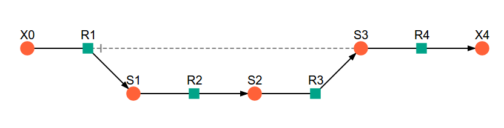

Included Files
==============

Here are the files that are used in the examples as well as the interactive
notebook versions of the documentation.

Models
------

The models used in this documentation are included below (together with other
additional files). These files must be downloaded to the ``psc`` directory to be
used in the example notebooks unless otherwise specified.

example_model.psc
^^^^^^^^^^^^^^^^^

.. image:: included_files_files/example_model.png

:download:`model <included_files/example_model.psc>`

:download:`layout file <included_files/example_model_layout.dict>`

The text of ``example_model.psc`` is included below:

.. code:: python

    # example_model.psc
    # -----------------------------------------------------------------------------
    # Fixed Species

    FIX: X0 X2 X3

    # -----------------------------------------------------------------------------
    # Reaction definitions

    R1:
        X0 = S1
        ((Vf1 / Km1_X0) * (X0 - S1 / Keq1)) / (1 + X0/Km1_X0 + S1/Km1_S1)

    R2:
        S1 = X2
        ((Vf2 / Km2_S1) * (S1 - X2 / Keq2)) / (1 + S1/Km2_S1 + X2/Km2_X2)

    R3:
        S1 = X3
        ((Vf3 / Km3_S1) * (S1 - X3 / Keq3)) / (1 + S1/Km3_S1 + X3/Km3_X3)

    # -----------------------------------------------------------------------------
    # Variable species initial concentrations

    S1 = 1

    # -----------------------------------------------------------------------------
    # Fixed species concentrations

    X0 = 100
    X2 = 10
    X3 = 1

    # -----------------------------------------------------------------------------
    # Parameters

    Vf1 = 100.0
    Keq1 = 10.0
    Km1_X0 = 1.0
    Km1_S1 = 1.0

    Vf2 = 50.0
    Keq2 = 10.0
    Km2_S1 = 1.0
    Km2_X2 = 1.0

    Vf3 = 10.0
    Keq3 = 10.0
    Km3_S1 = 1.0
    Km3_X3 = 1.0
    # -----------------------------------------------------------------------------

lin4_fb.psc
^^^^^^^^^^^^^

:download:`model <included_files/lin4_fb.psc>`

:download:`layout file <included_files/lin4_fb.dict>`

:download:`separated rate equations file <included_files/lin4_fb.reqn>`

The text of ``lin4_fb.psc`` is included below:

.. code:: python

    # lin4_fb.psc
    # -----------------------------------------------------------------------------
    # Fixed Species

    FIX: X0 X4

    # -----------------------------------------------------------------------------
    # Reaction definitions

    R1:
        X0 = S1
        (Vf_1 * (X0 / X0_05_1) * (1 - ((S1/X0)/Keq_1)) *
        (X0/X0_05_1 + S1/S1_05_1)**(h_1-1)) /
        ((X0/X0_05_1 + S1/S1_05_1)**(h_1) +
        (1 + (S3/S3_05_1)**(h_1))/(1 + a_1 * (S3/S3_05_1)**(h_1)))

    R2:
        S1 = S2
        (Vf_2 * (S1 / S1_05_2) *
        (1 - ((S2/S1)/Keq_2))) / (1 + S1/S1_05_2 + S2/S2_05_2)

    R3:
        S2 = S3
        (Vf_3 * (S2 / S2_05_3) *
        (1 - ((S3/S2)/Keq_3))) / (1 + S2/S2_05_3 + S3/S3_05_3)

    R4:
        S3 = X4
        (Vf_4*S3)/(S3 + S3_05_4)

    # -----------------------------------------------------------------------------
    # Variable species initial concentrations

    S1 = 1
    S2 = 1
    S3 = 1

    # -----------------------------------------------------------------------------
    # Fixed species concentrations

    X0 = 1
    X4 = 1

    # -----------------------------------------------------------------------------
    # Parameters

    Vf_1 = 400.0
    Keq_1 = 100.0
    X0_05_1 = 1.0
    S1_05_1 = 10000.0
    h_1 = 4
    S3_05_1 = 5.0
    a_1 = 0.01

    Vf_2 = 10000.0
    Keq_2 = 10.0
    S1_05_2 = 1.0
    S2_05_2 = 1.0

    Vf_3 = 1000.0
    Keq_3 = 10.0
    S2_05_3 = 0.01
    S3_05_3 = 1.0

    Vf_4 = 50.0
    S3_05_4 = 1.0

    # -----------------------------------------------------------------------------

Example Notebooks
-----------------

The example Jupyter notebooks are runnable versions of the pages
`Basic Usage  <basic_usage.html>`_, `RateChar <RateChar.html>`_,
`Symca <Symca.html>`_  and `Thermokin <Thermokin.html>`_ found in
this documentation.

:download:`basic_usage.ipynb <example_notebooks/basic_usage.ipynb>`

:download:`RateChar.ipynb <example_notebooks/RateChar.ipynb>`

:download:`Symca.ipynb <example_notebooks/Symca.ipynb>`

:download:`Thermokin.ipynb <example_notebooks/Thermokin.ipynb>`

